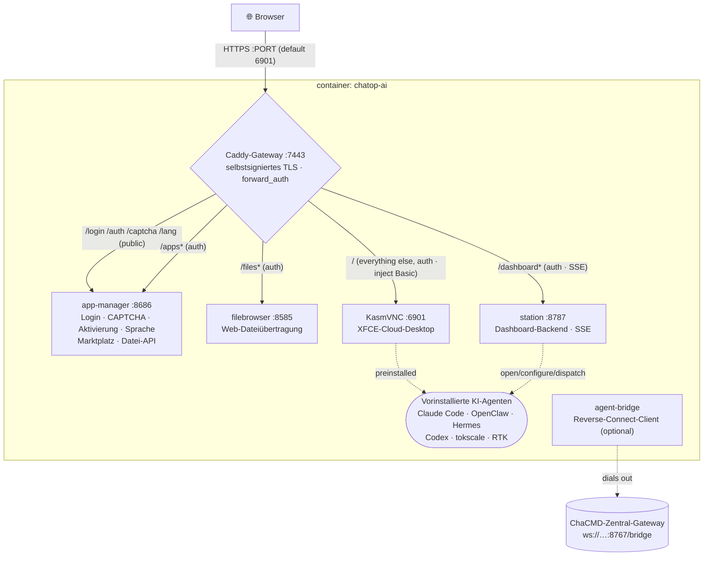

# chatop-ai · 察元AI工舱

> 🌐 **语言 / Language**: [简体中文](./README.md) ｜ [English](./README.en.md) ｜ [日本語](./README.ja.md) ｜ Deutsch ｜ [Русский](./README.ru.md) ｜ [Italiano](./README.it.md)

**Ein sofort einsatzbereiter Cloud-Desktop im Browser — eine unmittelbar verfügbare Remote-Arbeitsstation mit integrierten KI-Agenten.**
Ein individueller Cloud-Desktop auf Basis von KasmVNC: Browser öffnen, anmelden und einen chinesisch-/englischsprachigen Linux-Desktop erhalten, der mit KI-Agenten (Claude Code, OpenClaw, Hermes …), einem visuellen Konfigurator, einem App-Marktplatz, Dateiübertragung und einem Überwachungs-Dashboard für die Arbeitsstation vorinstalliert ist — alles gebündelt über einen **einzigen HTTPS-Port** und abgesichert durch ein **einheitliches Login-Gate**.

> Positionierung: die Arbeitsstation eines einzelnen „digitalen Mitarbeiters" (die **Ausführungsseite**). Eigenständig nutzbar oder als orchestrierter Knoten des **ChaCMD-Kommandosystems** (siehe [As a ChaCMD execution node](#as-a-chacmd-execution-node)).

---

## Inhaltsverzeichnis

- [Kernfunktionen](#key-features)
- [Architektur](#architecture)
- [Bereitstellung](#deployment)
  - [Variante 1 · Ein-Klick-Installer (Endnutzer)](#option-1--one-click-installer-end-users-recommended)
  - [Variante 2 · Aus dem Quellcode bauen (Entwicklung / Self-Hosting)](#option-2--build-from-source-dev--self-host)
  - [Variante 3 · Multi-Workbay (viele Nutzer, ein Host)](#option-3--multi-workbay-many-users-one-host)
  - [Veröffentlichte Images](#published-images)
- [Konfiguration (Umgebungsvariablen)](#configuration-environment-variables)
- [Daten & Persistenz](#data--persistence)
- [Seriennummern-Aktivierungs-Gate (optional)](#serial-number-activation-gate-optional)
- [Als ChaCMD-Ausführungsknoten](#as-a-chacmd-execution-node)
- [Lizenz](#license)

---

## Kernfunktionen

### 🖥️ Cloud-Desktop im Browser
- Ein **XFCE**-Desktop auf Basis von **KasmVNC** (`kasmweb/core-ubuntu-jammy`), Zugriff rein über den Browser — kein Client zu installieren.
- **Vollständig chinesische Umgebung**: `zh_CN.UTF-8`-Locale + Noto-CJK-/WenQuanYi-Schriften + chinesische Sprachpakete, Chinesisch ohne weitere Einrichtung.
- Mitgeliefertes **Google Chrome** (automatisch `--no-sandbox` innerhalb des Containers) als Träger für webbasierte Agenten.

### 🔒 Ein Port · einheitliches Login-Gate
- Stellt genau **einen HTTPS-Port** bereit (Standard `6901`); innerhalb des Containers stellt **Caddy** per Reverse-Proxy KasmVNC, den Datei-Browser, den App-Manager und das Dashboard bereit.
- **Individuell gebrandete Login-Seite**: Benutzername + Passwort + **grafisches CAPTCHA** (zustandsloses signiertes Cookie, keine serverseitige Speicherung).
- Nach der Anmeldung stellt das Gate ein Cookie aus und wendet `forward_auth` einheitlich auf **alle** Unterdienste an; die Basic-Zugangsdaten des Desktops werden vom Gateway injiziert, sodass die native Auth-Abfrage des Browsers **nie erscheint**.

### 🤖 Vorinstallierte KI-Agenten (per Doppelklick nutzbar)
Das Image installiert diese vor und erzeugt Desktop-Symbole — ein Doppelklick startet „zuerst konfigurieren, falls nicht konfiguriert, andernfalls direkt ausführen":

| Agent | Anmerkungen |
|---|---|
| **Claude Code** | Offizielle Coding-CLI von Anthropic |
| **Codex** | OpenAI Codex CLI |
| **OpenClaw** | Multi-Channel-KI-Gateway (mit visuellem Konfigurator, siehe unten) |
| **Hermes Agent** | Residente Agent-Laufzeitumgebung (standardmäßig über `PREINSTALL_HEAVY=1` vorinstalliert) |
| **tokscale** | TUI zur Überwachung des Token-Verbrauchs |
| **RTK** | Werkzeug zum Token-Sparen |
| **OpenHuman** | Human-in-the-Loop-Desktop-Agent (standardmäßig nicht vorinstalliert; bei Bedarf über den Marktplatz installieren) |

### 🧩 Visueller OpenClaw-Konfigurator
- Ein tkinter-Assistent (`openclaw-tool/`), **JSON-Schema-gesteuertes** rekursives Rendering, mit zweisprachigen (CN/EN) Beschriftungen.
- Deckt Modelle (primär / Fallback / Vision), Multi-Channel-Tokens und -Richtlinien (Telegram / Discord …), Sitzungsbereich und mehr ab — speichern und das Gateway neu starten, um sie anzuwenden.
- Ein **Snapshot** des openclaw-Katalogs (≥20 Kanäle) wird zur Build-Zeit eingebacken; die GUI liest ausschließlich den Snapshot und ruft die CLI auf dem Startpfad nie auf (vermeidet die Verzögerung von 8–12 s pro Aufruf).

### 🏪 App-Marktplatz (125+ Apps, für China optimiert)
- `app-manager` bietet einen grafischen Marktplatz: Installieren / Deinstallieren / Starten mit einem Klick und Live-Fortschrittsprotokollen.
- **125 Apps**: KI-CLIs, KI-IDEs/-Erweiterungen, Laufzeitumgebungen, Office, IM, Medien sowie 90+ PRoot-verpackte GUI-Apps (im Home-Verzeichnis des Nutzers installiert, ohne root).
- **China-Optimierung**: npm / pip / GitHub / GHCR werden alle über inländische Mirrors geleitet (`mirrors.conf`); Apps wählen automatisch die `cn`-/`intl`-Quelle passend zur UI-Sprache.

### 📊 Arbeitsstations-Dashboard
- `station` (FastAPI, Port `8787`) + `dashboard-web` (React + Vite): ein Live-Dashboard, das mit dem Desktop automatisch startet.
- Zeigt eine Agenten-Wand (Status / CPU / Speicher / Sitzungen), eine Aufgabenliste (**live über SSE**), Aufgabenversand sowie Container-Ressourcen + Zustand pro Dienst.
- Agenten direkt vom Dashboard aus öffnen / konfigurieren / beauftragen.

### 📂 Dateiübertragung · Zwischenablage-Steuerung
- Mitgeliefertes **filebrowser** (durch das Gateway-Cookie abgesichert) für Web-Upload/-Download; Upload und Download sind unabhängig umschaltbar, die Größenbeschränkung pro Datei ist konfigurierbar.
- **Bidirektionale, unabhängige** Zwischenablage-Schalter: Container→Host und Host→Container können jeweils erlaubt/verweigert werden.

### 🌐 Mehrsprachig (5 Sprachen)
- Vereinfachtes Chinesisch / Englisch / Traditionelles Chinesisch / Japanisch / Koreanisch.
- Login-, Auth- und Aktivierungstexte vollständig übersetzt; die Sprachauswahl wird in einem Cookie + einer Volume-Datei gespeichert, und die Desktop-Locale folgt (Desktop neu starten, um eine Änderung anzuwenden).

---

## Architektur

### Image-Schichten (mehrstufiger Build)
```
① web      : node:20-alpine  → builds the custom noVNC frontend (novnc-src/)
② dashweb  : node:20-alpine  → builds the dashboard frontend (dashboard-web/)
③ runtime  : kasmweb/core-ubuntu-jammy:1.19.0
             + filebrowser + Caddy + Node22 + Python3.11 + Chrome + proot-apps
             + preinstalled agents → moved to seed-home (seeded back to the user volume at runtime)
             + app-manager / station / openclaw-tool / caddy config
```
> Schwere/netzwerkgebundene Schichten kommen zuerst (stabiler Cache, keine erneuten Downloads über Iterationen hinweg); sich schnell ändernde COPY-Schichten zuletzt; das `${VERSION}`-verbrauchende LABEL/ENV steht ganz am Ende, um vollständige Rebuilds bei einer Versionsanhebung zu vermeiden.

### Laufzeit-Ports & Gateway
Es gibt **nur einen externen Port**; jeder Dienst innerhalb des Containers wird über Caddy mit einheitlicher Authentifizierung gebündelt:



| Dienst im Container | Port | Zuständigkeit |
|---|---|---|
| Caddy | 7443 | Der einzige externe Zugang: TLS, Login-Auth, Reverse-Proxy |
| app-manager | 8686 | Login-Seite/CAPTCHA/Aktivierung/Sprache, Marktplatz, Dateiübertragungs-API (Python-stdlib-HTTP-Server) |
| filebrowser | 8585 | Web-Dateiverwaltung (noauth, durch das Gateway-Cookie abgesichert) |
| station | 8787 | Backend des Arbeitsstations-Dashboards (FastAPI, inkl. SSE) |
| KasmVNC | 6901 | Der Cloud-Desktop selbst (inkl. WebSocket) |

Start-Orchestrierung: der Container-Entrypoint `chatop-lang-entrypoint` (setzt zuerst die Locale auf die vom Nutzer gewählte Sprache) → die KasmVNC-Startkette → `custom_startup` startet nebenläufig **Home-Verzeichnis initialisieren → filebrowser → Caddy → app-manager → station → Hintergrundbild**.

---

## Bereitstellung

> Voraussetzung: Docker ist auf der Zielmaschine installiert. Wählen Sie eine der drei folgenden Varianten.

### Variante 1 · Ein-Klick-Installer (Endnutzer, empfohlen)

Ein Befehl erledigt „Docker prüfen/installieren → Konto & Passwort festlegen → Image ziehen → starten → Browser öffnen".

**Linux / macOS:**
```bash
curl -fsSL https://<your-domain>/install.sh | bash
```
**Windows (PowerShell):**
```powershell
irm https://<your-domain>/install.ps1 | iex
```

- Sie werden nach einem **Login-Benutzernamen/-Passwort** gefragt (Passwort leer lassen, um es automatisch zu generieren); nach Abschluss öffnet sich `https://localhost:6901` (selbstsigniertes Zertifikat — im Browser auf „Fortfahren" klicken).
- **Langsame Downloads in China?** Verwenden Sie das Aliyun-ACR-Image:
  ```bash
  CHATOP_IMAGE=crpi-4i9j7th8clu2wz0j.cn-beijing.personal.cr.aliyuncs.com/cmdbird/chatop:latest \
    curl -fsSL https://<your-domain>/install.sh | bash
  ```
- **Nicht-interaktiv** (Automatisierung): `CHATOP_USER` / `CHATOP_PASSWORD` / `CHATOP_PORT` / `CHATOP_IMAGE` voreinstellen.
- Kein Docker vorhanden: Linux installiert über `get.docker.com`; macOS über Homebrew; Windows über winget/choco (Docker Desktop), andernfalls öffnet sich die Download-Seite und der Vorgang wird beim erneuten Ausführen fortgesetzt.

Der Installer schreibt `.env` + `docker-compose.yml` unter `~/.chatop` (Windows `%USERPROFILE%\.chatop`). Alltägliches Stoppen/Starten:
```bash
cd ~/.chatop && docker compose down      # stop (keeps the data volume)
cd ~/.chatop && docker compose up -d      # start
cd ~/.chatop && docker compose pull && docker compose up -d   # update to the latest image
```

Installer-Skripte: [`install/`](./install/).

### Variante 2 · Aus dem Quellcode bauen (Entwicklung / Self-Hosting)

Aus dem Quellcode bauen und den Container starten (einzelnes Dockerfile, Layer-Cache auf demselben Host, keine erneuten Downloads über Iterationen hinweg):
```bash
cp .env.example .env      # adjust port / password
./build-and-run.sh        # auto-bumps the version → builds → starts (container name is fixed: chatop-ai)
```
Aufrufen: `https://localhost:${PORT:-6901}`.

- Download über einen Build-Proxy: `./build-and-run.sh http://127.0.0.1:7890`
- Optionale Build-Argumente (`docker compose build --build-arg ...`):
  - `PREINSTALL_HEAVY=1` (Standard) installiert Hermes vor; `PREINSTALL_OPENHUMAN=1` backt zusätzlich OpenHuman ein (~+1,3 GB).
  - `CHATOP_LICENSE_HMAC_KEY=<64-hex>` aktiviert das Seriennummern-Aktivierungs-Gate (siehe unten).
  - `WITH_CHAYUAN_DESKTOP=1` backt den Chayuan-Desktop-Client (Lite) ein, wenn unter `vendor/` eine `.deb` vorhanden ist.

### Variante 3 · Multi-Workbay (viele Nutzer, ein Host)

Beliebig viele voneinander isolierte Workbays auf **demselben Host** bereitstellen: jede mit eigenem Login/Passwort/Datenverzeichnis/Container und **automatischer Port-Ausweichung**.
```bash
cd workbay
./new-workbay.sh                       # prompts for username+password, auto-picks a free port, starts
WB_USER=alice WB_PW='strong-pass' ./new-workbay.sh   # non-interactive
./reset-workbay.sh alice               # change a workbay's account/password (port unchanged)
```
- Die Ports beginnen bei `6901` und überspringen alles bereits Belegte; die Daten jedes Workbays liegen in `workbays/<user>/home` (bind-mounted; das Entfernen des Containers erhält die Daten).
- Passwörter mit `$`, Leerzeichen, Anführungszeichen usw. sind **byte-exakt sicher** (`$`→`$$` beim Schreiben der `.env`; beim Zurücklesen niemals `source`).
- Details: [`workbay/README.md`](./workbay/README.md).

### Veröffentlichte Images

Die Images teilen sich das `latest`-Tag (ein neues Release überschreibt dasselbe Tag, sodass Nutzer stets das neueste ziehen):

| Registry | Adresse |
|---|---|
| Docker Hub (Standard) | `cmdbird/chatop:latest` |
| Aliyun ACR (China-Beschleunigung) | `crpi-4i9j7th8clu2wz0j.cn-beijing.personal.cr.aliyuncs.com/cmdbird/chatop:latest` |

---

## Konfiguration (Umgebungsvariablen)

Diese in `.env` festlegen (oder in der vom Installer erzeugten `.env`):

| Variable | Standard | Beschreibung |
|---|---|---|
| `PORT` | `6901` | Der einzige externe HTTPS-Port |
| `PASSWORD` | — **(erforderlich)** | Login-Passwort |
| `LOGIN_USER` | `admin` | Web-Login-Benutzername (der OS-Nutzer im Container ist stets `admin`) |
| `FILES_UPLOAD` | `1` | Web-Upload erlauben (`0` deaktiviert) |
| `FILES_DOWNLOAD` | `1` | Web-Download erlauben (`0` deaktiviert) |
| `FILES_DIR` | `~/Desktop` | Upload-Ziel-/Download-Quellverzeichnis |
| `CLIPBOARD_OUT` | `1` | Im Container kopieren → auf dem Host einfügen |
| `CLIPBOARD_IN` | `1` | Auf dem Host kopieren → im Container einfügen |
| `CHATOP_LICENSE_HMAC_KEY` | leer | Aktivierungsschlüssel (64-hex); leer = Gate aus. Zur **Build-Zeit** eingebacken oder zur Laufzeit überschrieben |
| `CHATOP_MACHINE_ID` | leer | Fester Maschinen-Fingerabdruck (optional); der Standard-Fingerabdruck leitet sich aus dem Datenvolume ab und ändert sich, wenn das Volume gelöscht wird |

> Interne Dienst-Ports (`APPS_PORT=8686` / `FB_PORT=8585` / `STATION_PORT=8787`) müssen in der Regel nicht geändert werden — sie sind innerhalb des Containers nur per Loopback erreichbar und werden von Caddy gebündelt.

---

## Daten & Persistenz

- Das Nutzerdaten-Volume wird im Container unter `/home/admin` eingebunden (Compose-Volume `chatop-home` oder `workbays/<user>/home` im Multi-Workbay-Modus).
- Innerhalb des Volumes enthält `~/.local/share/chatop/`: den Maschinen-Fingerabdruck (`node-id`), den Aktivierungsdatensatz (`activation.json`) und die Sprachauswahl (`lang`).
- `docker compose down` erhält das Volume; `down -v` **löscht das Volume** — Sie verlieren Daten, der Fingerabdruck ändert sich und eine erneute Aktivierung ist erforderlich.

---

## Seriennummern-Aktivierungs-Gate (optional)

Das offizielle Image kann eine **vollständig offline** arbeitende Seriennummern-Aktivierung einbetten (`app-manager/chatop_license/`, HMAC-SHA256, ohne Netzwerk):

- **Aktivieren**: `CHATOP_LICENSE_HMAC_KEY` zur Build-Zeit injizieren (derselbe Schlüssel wie das ausstellende Backend); die Login-Seite zeigt dann ein Seriennummern-Eingabefeld. Ohne ihn ist das Gate aus und das Verhalten fällt auf „Benutzername + Passwort + CAPTCHA" zurück.
- **Maschinengebunden**: die Signatur des Aktivierungsdatensatzes enthält den Maschinen-Fingerabdruck — verhindert maschinenübergreifendes Kopieren, Manipulation des Ablaufdatums und Verlängerung durch Uhr-Rückstellung.
- **Weiche Durchleitung**: nach 3 Fehlversuchen innerhalb von 15 Minuten degradiert diese Sitzung zu reiner Passwort-Anmeldung (stellt ein 24-Stunden-Kulanz-Cookie aus), aber der Aktivierungsdatensatz wird **nicht persistiert** — die nächste Anmeldung erfordert weiterhin eine Seriennummer, was ein „Erschwindeln" der Aktivierung verhindert.
- **Hinweis**: vollständig offline durchgeführte Verifizierung bedeutet, dass das Image einen symmetrischen Schlüssel enthält. Wird das Image in eine öffentliche Registry gepusht, ist der Schlüssel öffentlich — dies ist ein **geschäftliches Gate**, kein kryptografischer Kopierschutz.

---

## Als ChaCMD-Ausführungsknoten

Dieses Image = die Arbeitsstation eines digitalen Mitarbeiters (die **Ausführungsseite**). Die zentrale Orchestrierung/Planung übernimmt das **ChaCMD-Kommandosystem** (`/work/chayuan-desktop`).

Innerhalb des Containers ist [`agent-bridge/`](./agent-bridge/) ein **Reverse-Connect-Client**: er wählt sich zum ChaCMD-Gateway (`ws://<chacmd-host>:8767/bridge`) hinaus und registriert sich per **Spitzname** (eine logische Identität, keine IP) + **Abteilung**, dann sendet er Heartbeats (NAT-/Isolierungsfreundlich — die Zentrale verbindet sich nie in den Container hinein). Der Scheduler, das CI-Gate, das Review und die Morning-Queue-Mechanismen befinden sich in einer DMZ-Isolationszone.

> `agent-bridge` ist eine reservierte residente Komponente für das ChaCMD-Ökosystem; für die End-to-End-Integration beider Projekte siehe `/work/chayuan-desktop/chacmd/README.md`.

---

## Lizenz

Veröffentlicht unter **GPL-2.0**; vollständiger Text in [`LICENSE`](./LICENSE).

Es ist quelloffen, weil die Cloud-Desktop-Basis **KasmVNC unter GPL-2.0 steht** und wir sie mit dem Image weiterverteilen. Der Quellcode ist öffentlich, die Nebenläufigkeit ist unbegrenzt, die Marke ist freigeschaltet — Sie dürfen das Image modifizieren, weiterverteilen und selbst aus dem Quellcode bauen.

Die im offiziellen Image eingebettete Seriennummern-Aktivierung (`app-manager/chatop_license/`, vollständig offline, HMAC) erkauft Ihnen einen **sofort lauffähigen offiziellen Build, laufende Updates und kommerziellen Support** — kein „Freischalten von Funktionen". Gemäß GPL-2.0 §6 erlegt dieses Projekt Ihrer Ausübung der Lizenzrechte keine weiteren Einschränkungen auf.

Zu beachtende Abgrenzungen:
- `novnc-src/` ist eine vendorierte Kopie von [@kasmtech/noVNC](https://github.com/kasmtech/noVNC) unter **MPL-2.0** (sowie BSD / OFL / CC BY-SA), die ihre eigene [`novnc-src/LICENSE.txt`](./novnc-src/LICENSE.txt) beibehält.
- **Das Image zu verteilen = KasmVNC zu verteilen**: GPL-2.0 §3 verlangt das Mitliefern des entsprechenden Quellcodes oder ein mindestens drei Jahre gültiges schriftliches Angebot.
- Das offizielle Image installiert **Google Chrome, Claude Code und andere proprietäre Software** vor, die jeweils ihren eigenen Upstream-Bedingungen unterliegen und außerhalb des GPL-2.0-Rahmens dieses Projekts stehen; prüfen Sie deren Bedingungen vor einer öffentlichen Weiterverteilung.

Vollständige Drittkomponenten und Lizenzhinweise: [`THIRD-PARTY-NOTICES.md`](./THIRD-PARTY-NOTICES.md); Design-Dokumente unter [`docs/`](./docs/).
