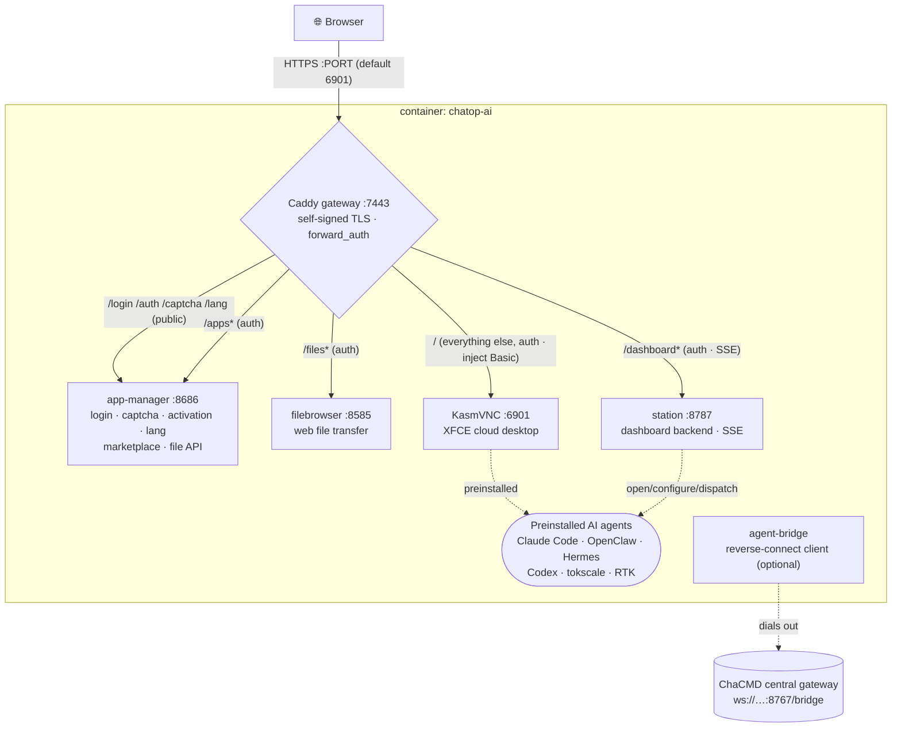

# chatop-ai · Chayuan AI Workbay

> 🌐 **语言 / Language**: [简体中文](./README.md) ｜ English ｜ [日本語](./README.ja.md) ｜ [Deutsch](./README.de.md) ｜ [Русский](./README.ru.md) ｜ [Italiano](./README.it.md)

**A ready-to-use browser cloud desktop — an instant remote workstation with AI agents built in.**
A KasmVNC-based custom cloud desktop: open a browser, log in, and get a Chinese/English Linux desktop preloaded with AI agents (Claude Code, OpenClaw, Hermes …), a visual configurator, an app marketplace, file transfer, and a workstation monitoring dashboard — all funneled through a **single HTTPS port** and guarded by a **unified login gate**.

> Positioning: the workstation of a single "digital employee" (the **execution side**). Usable standalone, or as an orchestrated node of the **ChaCMD command system** (see [As a ChaCMD execution node](#as-a-chacmd-execution-node)).

---

## Table of Contents

- [Key Features](#key-features)
- [Architecture](#architecture)
- [Deployment](#deployment)
  - [Option 1 · One-click installer (end users)](#option-1--one-click-installer-end-users-recommended)
  - [Option 2 · Build from source (dev / self-host)](#option-2--build-from-source-dev--self-host)
  - [Option 3 · Multi-workbay (many users, one host)](#option-3--multi-workbay-many-users-one-host)
  - [Published images](#published-images)
- [Configuration (environment variables)](#configuration-environment-variables)
- [Data & persistence](#data--persistence)
- [Serial-number activation gate (optional)](#serial-number-activation-gate-optional)
- [As a ChaCMD execution node](#as-a-chacmd-execution-node)
- [License](#license)

---

## Key Features

### 🖥️ Browser cloud desktop
- An **XFCE** desktop on top of **KasmVNC** (`kasmweb/core-ubuntu-jammy`), accessed purely via the browser — no client to install.
- **Full Chinese environment**: `zh_CN.UTF-8` locale + Noto CJK / WenQuanYi fonts + Chinese language packs, Chinese out of the box.
- Bundled **Google Chrome** (auto `--no-sandbox` inside the container) as the carrier for web-based agents.

### 🔒 Single port · unified login gate
- Exposes exactly **one HTTPS port** (default `6901`); inside the container **Caddy** reverse-proxies KasmVNC, the file browser, the app manager, and the dashboard.
- **Custom branded login page**: username + password + **graphical CAPTCHA** (stateless signed cookie, no server-side storage).
- After login the gate issues a cookie and applies `forward_auth` to **all** sub-services uniformly; the desktop's Basic credentials are injected by the gateway, so the browser's native auth prompt **never appears**.

### 🤖 Preinstalled AI agents (double-click to use)
The image preinstalls these and generates desktop icons — double-click launches "configure-first if unconfigured, otherwise run directly":

| Agent | Notes |
|---|---|
| **Claude Code** | Anthropic's official coding CLI |
| **Codex** | OpenAI Codex CLI |
| **OpenClaw** | Multi-channel AI gateway (with a visual configurator, below) |
| **Hermes Agent** | Resident agent runtime (preinstalled by default via `PREINSTALL_HEAVY=1`) |
| **tokscale** | Token-usage monitoring TUI |
| **RTK** | Token-saving utility |
| **OpenHuman** | Human-in-the-loop desktop agent (not preinstalled by default; install on demand from the marketplace) |

### 🧩 OpenClaw visual configurator
- A tkinter wizard (`openclaw-tool/`), **JSON-Schema-driven** recursive rendering, with bilingual (CN/EN) labels.
- Covers models (primary / fallback / vision), multi-channel (Telegram / Discord …) tokens and policies, session scope, and more — save and restart the gateway to apply.
- A **snapshot** of the openclaw catalog (≥20 channels) is baked at build time; the GUI reads only the snapshot and never invokes the CLI on the launch path (avoiding the 8–12 s per-call stall).

### 🏪 App marketplace (125+ apps, China-optimized)
- `app-manager` provides a graphical marketplace: one-click install / uninstall / launch with live progress logs.
- **125 apps**: AI CLIs, AI IDEs/extensions, runtimes, office, IM, media, plus 90+ PRoot-packaged GUI apps (installed into the user's home, no root).
- **China optimization**: npm / pip / GitHub / GHCR all routed through domestic mirrors (`mirrors.conf`); apps auto-select `cn`/`intl` source following the UI language.

### 📊 Workstation dashboard
- `station` (FastAPI, port `8787`) + `dashboard-web` (React + Vite): a live dashboard that auto-starts with the desktop.
- Shows an agent wall (status / CPU / memory / sessions), a task list (**live via SSE**), task dispatch, and container resource + per-service health.
- Open / configure / dispatch agents directly from the dashboard.

### 📂 File transfer · clipboard control
- Bundled **filebrowser** (gated by the gateway cookie) for web upload/download; upload and download are independently toggleable, per-file size limit configurable.
- **Bidirectional, independent** clipboard toggles: container→host and host→container can each be allowed/denied.

### 🌐 Multi-language (5 languages)
- Simplified Chinese / English / Traditional Chinese / Japanese / Korean.
- Login, auth, and activation text fully translated; the language choice is stored in a cookie + a volume file, and the desktop locale follows (restart the desktop to apply a change).

---

## Architecture

### Image layers (multi-stage build)
```
① web      : node:20-alpine  → builds the custom noVNC frontend (novnc-src/)
② dashweb  : node:20-alpine  → builds the dashboard frontend (dashboard-web/)
③ runtime  : kasmweb/core-ubuntu-jammy:1.19.0
             + filebrowser + Caddy + Node22 + Python3.11 + Chrome + proot-apps
             + preinstalled agents → moved to seed-home (seeded back to the user volume at runtime)
             + app-manager / station / openclaw-tool / caddy config
```
> Heavy/networked layers go first (stable cache, no re-downloads across iterations); fast-changing COPY layers last; the `${VERSION}`-consuming LABEL/ENV sits at the very end to avoid full rebuilds on a version bump.

### Runtime ports & gateway
There is **only one external port**; every in-container service is funneled through Caddy with unified auth:



| In-container service | Port | Responsibility |
|---|---|---|
| Caddy | 7443 | The only external entry: TLS, login auth, reverse proxy |
| app-manager | 8686 | Login page/CAPTCHA/activation/language, marketplace, file-transfer API (Python stdlib HTTP server) |
| filebrowser | 8585 | Web file management (noauth, gated by the gateway cookie) |
| station | 8787 | Workstation dashboard backend (FastAPI, incl. SSE) |
| KasmVNC | 6901 | The cloud desktop itself (incl. WebSocket) |

Startup orchestration: the container entrypoint `chatop-lang-entrypoint` (sets the locale to the user's chosen language first) → the KasmVNC startup chain → `custom_startup` concurrently launches **seed the home dir → filebrowser → Caddy → app-manager → station → wallpaper**.

---

## Deployment

> Prerequisite: Docker installed on the target machine. Pick one of the three options below.

### Option 1 · One-click installer (end users, recommended)

One command does "check/install Docker → set account & password → pull the image → start → open browser".

**Linux / macOS:**
```bash
curl -fsSL https://<your-domain>/install.sh | bash
```
**Windows (PowerShell):**
```powershell
irm https://<your-domain>/install.ps1 | iex
```

- You'll be prompted for a **login username/password** (leave the password blank to auto-generate); when done it opens `https://localhost:6901` (self-signed cert — click "proceed" in the browser).
- **Slow pulls in China?** Use the Aliyun ACR image:
  ```bash
  CHATOP_IMAGE=crpi-4i9j7th8clu2wz0j.cn-beijing.personal.cr.aliyuncs.com/cmdbird/chatop:latest \
    curl -fsSL https://<your-domain>/install.sh | bash
  ```
- **Non-interactive** (automation): preset `CHATOP_USER` / `CHATOP_PASSWORD` / `CHATOP_PORT` / `CHATOP_IMAGE`.
- No Docker present: Linux installs via `get.docker.com`; macOS via Homebrew; Windows via winget/choco (Docker Desktop), otherwise it opens the download page and resumes on re-run.

The installer writes `.env` + `docker-compose.yml` under `~/.chatop` (Windows `%USERPROFILE%\.chatop`). Day-to-day stop/start:
```bash
cd ~/.chatop && docker compose down      # stop (keeps the data volume)
cd ~/.chatop && docker compose up -d      # start
cd ~/.chatop && docker compose pull && docker compose up -d   # update to the latest image
```

Installer scripts: [`install/`](./install/).

### Option 2 · Build from source (dev / self-host)

Build from source and start the container (single Dockerfile, layer cache on the same host, no re-downloads across iterations):
```bash
cp .env.example .env      # adjust port / password
./build-and-run.sh        # auto-bumps the version → builds → starts (container name is fixed: chatop-ai)
```
Visit `https://localhost:${PORT:-6901}`.

- Download through a build proxy: `./build-and-run.sh http://127.0.0.1:7890`
- Optional build args (`docker compose build --build-arg ...`):
  - `PREINSTALL_HEAVY=1` (default) preinstalls Hermes; `PREINSTALL_OPENHUMAN=1` also bakes in OpenHuman (~+1.3 GB).
  - `CHATOP_LICENSE_HMAC_KEY=<64-hex>` enables the serial-number activation gate (below).
  - `WITH_CHAYUAN_DESKTOP=1` bakes in the Chayuan desktop client (Lite) when a `.deb` exists under `vendor/`.

### Option 3 · Multi-workbay (many users, one host)

Deploy any number of mutually isolated workbays on the **same host**: each has its own login/password/data dir/container, with **automatic port avoidance**.
```bash
cd workbay
./new-workbay.sh                       # prompts for username+password, auto-picks a free port, starts
WB_USER=alice WB_PW='strong-pass' ./new-workbay.sh   # non-interactive
./reset-workbay.sh alice               # change a workbay's account/password (port unchanged)
```
- Ports start at `6901` and skip anything already in use; each workbay's data lives in `workbays/<user>/home` (bind-mounted; removing the container keeps the data).
- Passwords with `$`, spaces, quotes, etc. are **byte-exact safe** (`$`→`$$` when writing `.env`; never `source`-d on read-back).
- Details: [`workbay/README.md`](./workbay/README.md).

### Published images

Images share the `latest` tag (a new release overwrites the same tag, so users always pull the newest):

| Registry | Address |
|---|---|
| Docker Hub (default) | `cmdbird/chatop:latest` |
| Aliyun ACR (China acceleration) | `crpi-4i9j7th8clu2wz0j.cn-beijing.personal.cr.aliyuncs.com/cmdbird/chatop:latest` |

---

## Configuration (environment variables)

Set these in `.env` (or the installer-generated `.env`):

| Variable | Default | Description |
|---|---|---|
| `PORT` | `6901` | The single external HTTPS port |
| `PASSWORD` | — **(required)** | Login password |
| `LOGIN_USER` | `admin` | Web login username (the in-container OS user is always `admin`) |
| `FILES_UPLOAD` | `1` | Allow web upload (`0` disables) |
| `FILES_DOWNLOAD` | `1` | Allow web download (`0` disables) |
| `FILES_DIR` | `~/Desktop` | Upload target / download source directory |
| `CLIPBOARD_OUT` | `1` | Copy inside container → paste on host |
| `CLIPBOARD_IN` | `1` | Copy on host → paste inside container |
| `CHATOP_LICENSE_HMAC_KEY` | empty | Activation key (64-hex); empty = gate off. Baked in at **build time**, or overridden at runtime |
| `CHATOP_MACHINE_ID` | empty | Fixed machine fingerprint (optional); the default fingerprint derives from the data volume and changes if the volume is deleted |

> Internal service ports (`APPS_PORT=8686` / `FB_PORT=8585` / `STATION_PORT=8787`) usually need no change — they are loopback-only inside the container and funneled by Caddy.

---

## Data & persistence

- User data volume is mounted at `/home/admin` inside the container (compose volume `chatop-home`, or `workbays/<user>/home` in multi-workbay mode).
- Inside the volume, `~/.local/share/chatop/` holds: the machine fingerprint (`node-id`), the activation record (`activation.json`), and the language choice (`lang`).
- `docker compose down` keeps the volume; `down -v` **deletes the volume** — you lose data, the fingerprint changes, and re-activation is required.

---

## Serial-number activation gate (optional)

The official image can embed a **fully offline** serial-number activation (`app-manager/chatop_license/`, HMAC-SHA256, no network):

- **Enable**: inject `CHATOP_LICENSE_HMAC_KEY` at build time (the same key as the issuing backend); the login page then shows a serial input. Without it, the gate is off and behavior falls back to "username + password + CAPTCHA".
- **Machine-bound**: the activation record's signature includes the machine fingerprint — preventing cross-machine copying, expiry tampering, and clock-rollback renewal.
- **Soft pass-through**: after 3 wrong attempts within 15 minutes, this session degrades to password-only login (issues a 24h grace cookie), but the activation record is **not persisted** — the next login still requires a serial, preventing "bluffing" your way into activation.
- **Note**: fully offline verification means the image contains a symmetric key. If the image is pushed to a public registry, the key is public — this is a **business gate**, not cryptographic anti-piracy.

---

## As a ChaCMD execution node

This image = the workstation of one digital employee (the **execution side**). Central orchestration/scheduling is handled by the **ChaCMD command system** (`/work/chayuan-desktop`).

Inside the container, [`agent-bridge/`](./agent-bridge/) is a **reverse-connect client**: it dials out to the ChaCMD gateway (`ws://<chacmd-host>:8767/bridge`) and registers by **nickname** (a logical identity, not an IP) + **department**, then heartbeats (NAT/isolation friendly — the center never connects into the container). The scheduler, CI gate, review, and morning-queue mechanisms live in a DMZ isolation zone.

> `agent-bridge` is a reserved resident component for the ChaCMD ecosystem; for end-to-end integration of both projects see `/work/chayuan-desktop/chacmd/README.md`.

---

## License

Released under **GPL-2.0**; full text in [`LICENSE`](./LICENSE).

It's open source because the cloud-desktop base **KasmVNC is GPL-2.0** and we redistribute it with the image. The source is public, concurrency is unlimited, the brand is unlocked — you may modify, redistribute, and build the image from source yourself.

The serial-number activation embedded in the official image (`app-manager/chatop_license/`, fully offline HMAC) buys you a **ready-to-run official build, ongoing updates, and commercial support** — not "feature unlocking". Per GPL-2.0 §6, this project imposes no further restrictions on your exercise of the license rights.

Boundaries to note:
- `novnc-src/` is a vendored copy of [@kasmtech/noVNC](https://github.com/kasmtech/noVNC), under **MPL-2.0** (and BSD / OFL / CC BY-SA), retaining its own [`novnc-src/LICENSE.txt`](./novnc-src/LICENSE.txt).
- **Distributing the image = distributing KasmVNC**: GPL-2.0 §3 requires bundling the corresponding source, or a written offer valid for at least three years.
- The official image preinstalls **Google Chrome, Claude Code, and other proprietary software**, each governed by its own upstream terms, outside this project's GPL-2.0 scope; verify their terms before public redistribution.

Full third-party components and license notes: [`THIRD-PARTY-NOTICES.md`](./THIRD-PARTY-NOTICES.md); design docs under [`docs/`](./docs/).
