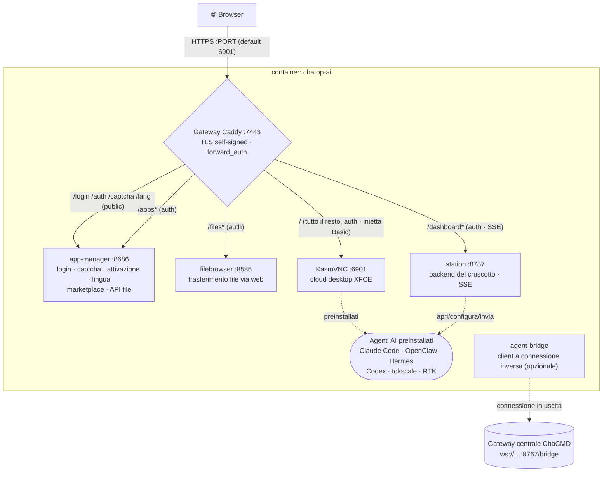

# chatop-ai · 察元AI工舱

> 🌐 **语言 / Language**: [简体中文](./README.md) ｜ [English](./README.en.md) ｜ [日本語](./README.ja.md) ｜ [Deutsch](./README.de.md) ｜ [Русский](./README.ru.md) ｜ Italiano

**Un cloud desktop nel browser pronto all'uso — una workstation remota istantanea con agenti AI integrati.**
Un cloud desktop personalizzato basato su KasmVNC: apri un browser, accedi e ottieni un desktop Linux cinese/inglese precaricato con agenti AI (Claude Code, OpenClaw, Hermes …), un configuratore visuale, un app marketplace, il trasferimento file e un cruscotto di monitoraggio della workstation — il tutto convogliato attraverso una **singola porta HTTPS** e protetto da un **gate di login unificato**.

> Posizionamento: la workstation di un singolo "dipendente digitale" (il **lato esecuzione**). Utilizzabile in modo autonomo, oppure come nodo orchestrato del **sistema di comando ChaCMD** (vedi [Come nodo di esecuzione ChaCMD](#as-a-chacmd-execution-node)).

---

## Indice

- [Funzionalità principali](#key-features)
- [Architettura](#architecture)
- [Deployment](#deployment)
  - [Opzione 1 · Installer con un clic (utenti finali)](#option-1--one-click-installer-end-users-recommended)
  - [Opzione 2 · Build dai sorgenti (dev / self-host)](#option-2--build-from-source-dev--self-host)
  - [Opzione 3 · Multi-workbay (molti utenti, un host)](#option-3--multi-workbay-many-users-one-host)
  - [Immagini pubblicate](#published-images)
- [Configurazione (variabili d'ambiente)](#configuration-environment-variables)
- [Dati e persistenza](#data--persistence)
- [Gate di attivazione con numero di serie (opzionale)](#serial-number-activation-gate-optional)
- [Come nodo di esecuzione ChaCMD](#as-a-chacmd-execution-node)
- [Licenza](#license)

---

## Funzionalità principali

### 🖥️ Cloud desktop nel browser
- Un desktop **XFCE** sopra a **KasmVNC** (`kasmweb/core-ubuntu-jammy`), accessibile puramente dal browser — nessun client da installare.
- **Ambiente cinese completo**: locale `zh_CN.UTF-8` + font Noto CJK / WenQuanYi + language pack cinesi, cinese pronto all'uso.
- **Google Chrome** integrato (con `--no-sandbox` automatico dentro il container) come vettore per gli agenti basati su web.

### 🔒 Porta unica · gate di login unificato
- Espone esattamente **una porta HTTPS** (predefinita `6901`); dentro il container **Caddy** fa da reverse proxy per KasmVNC, il file browser, l'app manager e il cruscotto.
- **Pagina di login con branding personalizzato**: username + password + **CAPTCHA grafico** (cookie firmato stateless, nessuna memorizzazione lato server).
- Dopo il login il gate emette un cookie e applica `forward_auth` a **tutti** i sotto-servizi in modo uniforme; le credenziali Basic del desktop vengono iniettate dal gateway, quindi il prompt di autenticazione nativo del browser **non appare mai**.

### 🤖 Agenti AI preinstallati (doppio clic per usarli)
L'immagine preinstalla questi elementi e genera icone sul desktop — il doppio clic avvia "configura prima se non configurato, altrimenti esegui direttamente":

| Agente | Note |
|---|---|
| **Claude Code** | La CLI di coding ufficiale di Anthropic |
| **Codex** | La CLI Codex di OpenAI |
| **OpenClaw** | Gateway AI multi-canale (con un configuratore visuale, più sotto) |
| **Hermes Agent** | Runtime di agente residente (preinstallato per impostazione predefinita tramite `PREINSTALL_HEAVY=1`) |
| **tokscale** | TUI per il monitoraggio dell'uso dei token |
| **RTK** | Utility per il risparmio di token |
| **OpenHuman** | Agente desktop human-in-the-loop (non preinstallato di default; installalo su richiesta dal marketplace) |

### 🧩 Configuratore visuale di OpenClaw
- Una procedura guidata tkinter (`openclaw-tool/`), rendering ricorsivo **guidato da JSON-Schema**, con etichette bilingui (CN/EN).
- Copre i modelli (primario / fallback / vision), token e policy multi-canale (Telegram / Discord …), scope della sessione e altro — salva e riavvia il gateway per applicare.
- Uno **snapshot** del catalogo openclaw (≥20 canali) viene incorporato in fase di build; la GUI legge solo lo snapshot e non invoca mai la CLI nel percorso di avvio (evitando lo stallo di 8–12 s per chiamata).

### 🏪 App marketplace (125+ app, ottimizzato per la Cina)
- `app-manager` fornisce un marketplace grafico: installazione / disinstallazione / avvio con un clic e log di avanzamento in tempo reale.
- **125 app**: CLI di AI, IDE/estensioni di AI, runtime, office, IM, media, oltre a 90+ app GUI impacchettate con PRoot (installate nella home dell'utente, senza root).
- **Ottimizzazione per la Cina**: npm / pip / GitHub / GHCR tutti instradati tramite mirror nazionali (`mirrors.conf`); le app selezionano automaticamente la sorgente `cn`/`intl` seguendo la lingua dell'interfaccia.

### 📊 Cruscotto della workstation
- `station` (FastAPI, porta `8787`) + `dashboard-web` (React + Vite): un cruscotto live che si avvia automaticamente con il desktop.
- Mostra un muro degli agenti (stato / CPU / memoria / sessioni), una lista di task (**in tempo reale tramite SSE**), l'invio di task e le risorse del container + lo stato di salute per servizio.
- Apri / configura / invia agenti direttamente dal cruscotto.

### 📂 Trasferimento file · controllo degli appunti
- **filebrowser** integrato (protetto dal cookie del gateway) per upload/download via web; upload e download sono attivabili in modo indipendente, il limite di dimensione per file è configurabile.
- Interruttori degli appunti **bidirezionali e indipendenti**: container→host e host→container possono essere consentiti/negati singolarmente.

### 🌐 Multilingua (5 lingue)
- Cinese semplificato / inglese / cinese tradizionale / giapponese / coreano.
- Testi di login, autenticazione e attivazione completamente tradotti; la scelta della lingua è memorizzata in un cookie + un file su volume, e il locale del desktop lo segue (riavvia il desktop per applicare una modifica).

---

## Architettura

### Layer dell'immagine (build multi-stage)
```
① web      : node:20-alpine  → builds the custom noVNC frontend (novnc-src/)
② dashweb  : node:20-alpine  → builds the dashboard frontend (dashboard-web/)
③ runtime  : kasmweb/core-ubuntu-jammy:1.19.0
             + filebrowser + Caddy + Node22 + Python3.11 + Chrome + proot-apps
             + preinstalled agents → moved to seed-home (seeded back to the user volume at runtime)
             + app-manager / station / openclaw-tool / caddy config
```
> I layer pesanti/di rete vengono per primi (cache stabile, nessun ri-download tra le iterazioni); i layer COPY che cambiano rapidamente per ultimi; la LABEL/ENV che consuma `${VERSION}` sta proprio alla fine per evitare rebuild completi al cambio di versione.

### Porte di runtime e gateway
C'è **una sola porta esterna**; ogni servizio interno al container viene convogliato attraverso Caddy con auth unificata:



| Servizio interno al container | Porta | Responsabilità |
|---|---|---|
| Caddy | 7443 | L'unico ingresso esterno: TLS, auth di login, reverse proxy |
| app-manager | 8686 | Pagina di login/CAPTCHA/attivazione/lingua, marketplace, API di trasferimento file (server HTTP della stdlib Python) |
| filebrowser | 8585 | Gestione file via web (noauth, protetto dal cookie del gateway) |
| station | 8787 | Backend del cruscotto della workstation (FastAPI, incl. SSE) |
| KasmVNC | 6901 | Il cloud desktop vero e proprio (incl. WebSocket) |

Orchestrazione dell'avvio: l'entrypoint del container `chatop-lang-entrypoint` (imposta prima il locale sulla lingua scelta dall'utente) → la catena di avvio di KasmVNC → `custom_startup` avvia in modo concorrente **seed della home dir → filebrowser → Caddy → app-manager → station → sfondo**.

---

## Deployment

> Prerequisito: Docker installato sulla macchina di destinazione. Scegli una delle tre opzioni qui sotto.

### Opzione 1 · Installer con un clic (utenti finali, consigliato)

Un solo comando esegue "verifica/installa Docker → imposta account e password → scarica l'immagine → avvia → apri il browser".

**Linux / macOS:**
```bash
curl -fsSL https://<your-domain>/install.sh | bash
```
**Windows (PowerShell):**
```powershell
irm https://<your-domain>/install.ps1 | iex
```

- Ti verranno chiesti uno **username/password di login** (lascia la password vuota per generarla automaticamente); al termine apre `https://localhost:6901` (certificato self-signed — clicca "procedi" nel browser).
- **Download lenti in Cina?** Usa l'immagine Aliyun ACR:
  ```bash
  CHATOP_IMAGE=crpi-4i9j7th8clu2wz0j.cn-beijing.personal.cr.aliyuncs.com/cmdbird/chatop:latest \
    curl -fsSL https://<your-domain>/install.sh | bash
  ```
- **Non interattivo** (automazione): preimposta `CHATOP_USER` / `CHATOP_PASSWORD` / `CHATOP_PORT` / `CHATOP_IMAGE`.
- Docker assente: Linux installa tramite `get.docker.com`; macOS tramite Homebrew; Windows tramite winget/choco (Docker Desktop), altrimenti apre la pagina di download e riprende alla successiva esecuzione.

L'installer scrive `.env` + `docker-compose.yml` sotto `~/.chatop` (su Windows `%USERPROFILE%\.chatop`). Stop/start quotidiano:
```bash
cd ~/.chatop && docker compose down      # stop (keeps the data volume)
cd ~/.chatop && docker compose up -d      # start
cd ~/.chatop && docker compose pull && docker compose up -d   # update to the latest image
```

Script dell'installer: [`install/`](./install/).

### Opzione 2 · Build dai sorgenti (dev / self-host)

Compila dai sorgenti e avvia il container (Dockerfile singolo, cache dei layer sullo stesso host, nessun ri-download tra le iterazioni):
```bash
cp .env.example .env      # adjust port / password
./build-and-run.sh        # auto-bumps the version → builds → starts (container name is fixed: chatop-ai)
```
Visita `https://localhost:${PORT:-6901}`.

- Download tramite un proxy di build: `./build-and-run.sh http://127.0.0.1:7890`
- Argomenti di build opzionali (`docker compose build --build-arg ...`):
  - `PREINSTALL_HEAVY=1` (predefinito) preinstalla Hermes; `PREINSTALL_OPENHUMAN=1` incorpora anche OpenHuman (~+1.3 GB).
  - `CHATOP_LICENSE_HMAC_KEY=<64-hex>` abilita il gate di attivazione con numero di serie (più sotto).
  - `WITH_CHAYUAN_DESKTOP=1` incorpora il client desktop Chayuan (Lite) quando esiste un `.deb` sotto `vendor/`.

### Opzione 3 · Multi-workbay (molti utenti, un host)

Distribuisci un numero qualsiasi di workbay reciprocamente isolate sullo **stesso host**: ciascuna ha il proprio login/password/directory dati/container, con **evitamento automatico delle porte**.
```bash
cd workbay
./new-workbay.sh                       # prompts for username+password, auto-picks a free port, starts
WB_USER=alice WB_PW='strong-pass' ./new-workbay.sh   # non-interactive
./reset-workbay.sh alice               # change a workbay's account/password (port unchanged)
```
- Le porte partono da `6901` e saltano tutto ciò che è già in uso; i dati di ogni workbay risiedono in `workbays/<user>/home` (bind-mounted; rimuovere il container conserva i dati).
- Le password con `$`, spazi, virgolette, ecc. sono **sicure byte per byte** (`$`→`$$` durante la scrittura di `.env`; mai `source`-ate in rilettura).
- Dettagli: [`workbay/README.md`](./workbay/README.md).

### Immagini pubblicate

Le immagini condividono il tag `latest` (una nuova release sovrascrive lo stesso tag, così gli utenti scaricano sempre la più recente):

| Registry | Indirizzo |
|---|---|
| Docker Hub (predefinito) | `cmdbird/chatop:latest` |
| Aliyun ACR (accelerazione Cina) | `crpi-4i9j7th8clu2wz0j.cn-beijing.personal.cr.aliyuncs.com/cmdbird/chatop:latest` |

---

## Configurazione (variabili d'ambiente)

Impostale in `.env` (o nel `.env` generato dall'installer):

| Variabile | Predefinito | Descrizione |
|---|---|---|
| `PORT` | `6901` | L'unica porta HTTPS esterna |
| `PASSWORD` | — **(obbligatoria)** | Password di login |
| `LOGIN_USER` | `admin` | Username di login web (l'utente OS interno al container è sempre `admin`) |
| `FILES_UPLOAD` | `1` | Consenti upload web (`0` disabilita) |
| `FILES_DOWNLOAD` | `1` | Consenti download web (`0` disabilita) |
| `FILES_DIR` | `~/Desktop` | Directory di destinazione upload / sorgente download |
| `CLIPBOARD_OUT` | `1` | Copia dentro il container → incolla sull'host |
| `CLIPBOARD_IN` | `1` | Copia sull'host → incolla dentro il container |
| `CHATOP_LICENSE_HMAC_KEY` | vuoto | Chiave di attivazione (64-hex); vuoto = gate disattivato. Incorporata in fase di **build**, oppure sovrascritta a runtime |
| `CHATOP_MACHINE_ID` | vuoto | Fingerprint fisso della macchina (opzionale); il fingerprint predefinito deriva dal volume dei dati e cambia se il volume viene eliminato |

> Le porte dei servizi interni (`APPS_PORT=8686` / `FB_PORT=8585` / `STATION_PORT=8787`) di solito non richiedono modifiche — sono solo in loopback dentro il container e convogliate da Caddy.

---

## Dati e persistenza

- Il volume dati utente è montato su `/home/admin` dentro il container (volume compose `chatop-home`, oppure `workbays/<user>/home` in modalità multi-workbay).
- Dentro il volume, `~/.local/share/chatop/` contiene: il fingerprint della macchina (`node-id`), il record di attivazione (`activation.json`) e la scelta della lingua (`lang`).
- `docker compose down` conserva il volume; `down -v` **elimina il volume** — perdi i dati, il fingerprint cambia ed è richiesta una nuova attivazione.

---

## Gate di attivazione con numero di serie (opzionale)

L'immagine ufficiale può incorporare un'attivazione con numero di serie **completamente offline** (`app-manager/chatop_license/`, HMAC-SHA256, nessuna rete):

- **Abilitazione**: inietta `CHATOP_LICENSE_HMAC_KEY` in fase di build (la stessa chiave del backend di emissione); la pagina di login mostrerà quindi un campo per il numero di serie. Senza di essa, il gate è disattivato e il comportamento ripiega su "username + password + CAPTCHA".
- **Vincolo alla macchina**: la firma del record di attivazione include il fingerprint della macchina — impedendo la copia tra macchine, la manomissione della scadenza e il rinnovo tramite rollback dell'orologio.
- **Pass-through morbido**: dopo 3 tentativi errati entro 15 minuti, questa sessione degrada al login con sola password (emette un cookie di grazia di 24h), ma il record di attivazione **non viene reso persistente** — il login successivo richiede comunque un numero di serie, impedendo di "bluffare" per ottenere l'attivazione.
- **Nota**: la verifica completamente offline significa che l'immagine contiene una chiave simmetrica. Se l'immagine viene pubblicata su un registry pubblico, la chiave è pubblica — si tratta di un **gate commerciale**, non di una protezione crittografica anti-pirateria.

---

## Come nodo di esecuzione ChaCMD

Questa immagine = la workstation di un dipendente digitale (il **lato esecuzione**). L'orchestrazione/pianificazione centrale è gestita dal **sistema di comando ChaCMD** (`/work/chayuan-desktop`).

Dentro il container, [`agent-bridge/`](./agent-bridge/) è un **client a connessione inversa**: si connette in uscita al gateway ChaCMD (`ws://<chacmd-host>:8767/bridge`) e si registra con un **nickname** (un'identità logica, non un IP) + **dipartimento**, quindi invia heartbeat (compatibile con NAT/isolamento — il centro non si connette mai dentro il container). Lo scheduler, il CI gate, la review e i meccanismi di coda mattutina risiedono in una zona di isolamento DMZ.

> `agent-bridge` è un componente residente riservato per l'ecosistema ChaCMD; per l'integrazione end-to-end di entrambi i progetti vedi `/work/chayuan-desktop/chacmd/README.md`.

---

## Licenza

Rilasciato sotto **GPL-2.0**; testo completo in [`LICENSE`](./LICENSE).

È open source perché la base del cloud desktop **KasmVNC è GPL-2.0** e la ridistribuiamo insieme all'immagine. Il codice sorgente è pubblico, la concorrenza è illimitata, il brand è sbloccato — puoi modificare, ridistribuire e compilare tu stesso l'immagine dai sorgenti.

L'attivazione con numero di serie incorporata nell'immagine ufficiale (`app-manager/chatop_license/`, HMAC completamente offline) ti offre una **build ufficiale pronta all'esecuzione, aggiornamenti continui e supporto commerciale** — non lo "sblocco di funzionalità". Ai sensi della GPL-2.0 §6, questo progetto non impone ulteriori restrizioni sull'esercizio dei diritti di licenza.

Confini da tenere presenti:
- `novnc-src/` è una copia vendorizzata di [@kasmtech/noVNC](https://github.com/kasmtech/noVNC), sotto **MPL-2.0** (e BSD / OFL / CC BY-SA), che conserva la propria [`novnc-src/LICENSE.txt`](./novnc-src/LICENSE.txt).
- **Distribuire l'immagine = distribuire KasmVNC**: la GPL-2.0 §3 richiede di includere il codice sorgente corrispondente, o un'offerta scritta valida per almeno tre anni.
- L'immagine ufficiale preinstalla **Google Chrome, Claude Code e altro software proprietario**, ciascuno regolato dai propri termini upstream, al di fuori dell'ambito GPL-2.0 di questo progetto; verifica i loro termini prima di una ridistribuzione pubblica.

Componenti di terze parti completi e note di licenza: [`THIRD-PARTY-NOTICES.md`](./THIRD-PARTY-NOTICES.md); documenti di progettazione sotto [`docs/`](./docs/).
