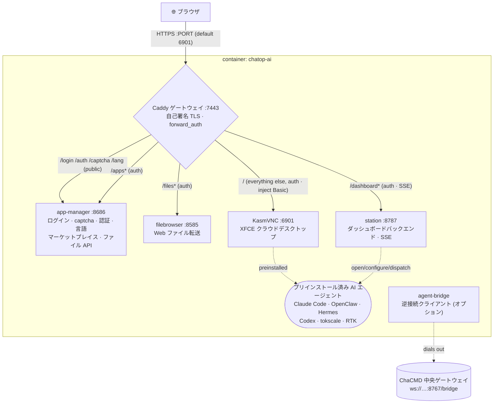

# chatop-ai · 察元AI工舱

> 🌐 **语言 / Language**: [简体中文](./README.md) ｜ [English](./README.en.md) ｜ 日本語 ｜ [Deutsch](./README.de.md) ｜ [Русский](./README.ru.md) ｜ [Italiano](./README.it.md)

**すぐに使えるブラウザ型クラウドデスクトップ — AIエージェントを内蔵した、即座に使えるリモートワークステーション。**
KasmVNC ベースのカスタムクラウドデスクトップです。ブラウザを開いてログインするだけで、AIエージェント（Claude Code、OpenClaw、Hermes …）、ビジュアル設定ツール、アプリマーケットプレイス、ファイル転送、ワークステーション監視ダッシュボードをプリロードした中国語/英語対応の Linux デスクトップが手に入ります。すべては**単一の HTTPS ポート**に集約され、**統一されたログインゲート**で保護されます。

> 位置づけ：一人の「デジタル従業員」のワークステーション（**実行側**）です。単体で利用できるほか、**ChaCMD 指揮システム**のオーケストレーションノードとしても利用できます（[ChaCMD 実行ノードとして](#as-a-chacmd-execution-node)を参照）。

---

## 目次

- [主な機能](#key-features)
- [アーキテクチャ](#architecture)
- [デプロイ](#deployment)
  - [方式1 · ワンクリックインストーラー（エンドユーザー）](#option-1--one-click-installer-end-users-recommended)
  - [方式2 · ソースからビルド（開発 / セルフホスト）](#option-2--build-from-source-dev--self-host)
  - [方式3 · マルチ工舱（1台のホストで複数ユーザー）](#option-3--multi-workbay-many-users-one-host)
  - [公開イメージ](#published-images)
- [設定（環境変数）](#configuration-environment-variables)
- [データと永続化](#data--persistence)
- [シリアルナンバー認証ゲート（オプション）](#serial-number-activation-gate-optional)
- [ChaCMD 実行ノードとして](#as-a-chacmd-execution-node)
- [ライセンス](#license)

---

## 主な機能

### 🖥️ ブラウザ型クラウドデスクトップ
- **KasmVNC**（`kasmweb/core-ubuntu-jammy`）上に構築された **XFCE** デスクトップを、ブラウザだけで利用できます。クライアントのインストールは不要です。
- **完全な中国語環境**：`zh_CN.UTF-8` ロケール + Noto CJK / WenQuanYi フォント + 中国語言語パックにより、そのまま中国語で利用できます。
- Web ベースのエージェントのキャリアとして、**Google Chrome** をバンドル（コンテナ内では自動的に `--no-sandbox`）。

### 🔒 単一ポート · 統一ログインゲート
- 外部に公開するのは **HTTPS ポート1つだけ**（デフォルト `6901`）。コンテナ内では **Caddy** が KasmVNC、ファイルブラウザ、アプリマネージャー、ダッシュボードをリバースプロキシします。
- **カスタムブランドのログインページ**：ユーザー名 + パスワード + **画像 CAPTCHA**（ステートレスな署名付き Cookie を使用し、サーバー側での保存は不要）。
- ログイン後、ゲートは Cookie を発行し、**すべて**のサブサービスに一律で `forward_auth` を適用します。デスクトップの Basic 認証情報はゲートウェイが注入するため、ブラウザネイティブの認証プロンプトが**表示されることはありません**。

### 🤖 プリインストール済み AI エージェント（ダブルクリックで利用）
イメージには以下がプリインストールされ、デスクトップアイコンが生成されます。ダブルクリックすると「未設定なら設定優先、設定済みならそのまま実行」が起動します。

| エージェント | 説明 |
|---|---|
| **Claude Code** | Anthropic 公式のコーディング CLI |
| **Codex** | OpenAI Codex CLI |
| **OpenClaw** | マルチチャネル AI ゲートウェイ（ビジュアル設定ツール付き、後述） |
| **Hermes Agent** | 常駐エージェントランタイム（`PREINSTALL_HEAVY=1` によりデフォルトでプリインストール） |
| **tokscale** | トークン使用量監視 TUI |
| **RTK** | トークン節約ユーティリティ |
| **OpenHuman** | Human-in-the-loop デスクトップエージェント（デフォルトではプリインストールされず、必要に応じてマーケットプレイスからインストール） |

### 🧩 OpenClaw ビジュアル設定ツール
- tkinter 製のウィザード（`openclaw-tool/`）で、**JSON-Schema 駆動**の再帰的レンダリングを行い、バイリンガル（中/英）ラベルに対応します。
- モデル（プライマリ / フォールバック / ビジョン）、マルチチャネル（Telegram / Discord …）のトークンとポリシー、セッションスコープなどをカバーします。保存してゲートウェイを再起動すると反映されます。
- openclaw カタログの**スナップショット**（20 チャネル以上）をビルド時に焼き込みます。GUI はスナップショットのみを読み込み、起動パス上で CLI を呼び出さないため、呼び出しごとの 8～12 秒の待機を回避します。

### 🏪 アプリマーケットプレイス（125+ アプリ、中国向け最適化）
- `app-manager` がグラフィカルなマーケットプレイスを提供します。ワンクリックでのインストール / アンインストール / 起動が可能で、進捗ログをリアルタイム表示します。
- **125 アプリ**：AI CLI、AI IDE/拡張機能、ランタイム、オフィス、IM、メディアに加え、90 以上の PRoot でパッケージ化された GUI アプリ（ユーザーのホームにインストールされ、root 不要）。
- **中国向け最適化**：npm / pip / GitHub / GHCR はすべて国内ミラー（`mirrors.conf`）経由でルーティングされます。アプリは UI 言語に従って `cn`/`intl` ソースを自動選択します。

### 📊 ワークステーションダッシュボード
- `station`（FastAPI、ポート `8787`）+ `dashboard-web`（React + Vite）：デスクトップとともに自動起動するライブダッシュボードです。
- エージェントウォール（ステータス / CPU / メモリ / セッション）、タスクリスト（**SSE によるライブ更新**）、タスクディスパッチ、コンテナリソースとサービスごとのヘルスを表示します。
- ダッシュボードから直接エージェントを開く / 設定する / ディスパッチできます。

### 📂 ファイル転送 · クリップボード制御
- **filebrowser** をバンドル（ゲートウェイ Cookie で保護）し、Web でのアップロード/ダウンロードを提供します。アップロードとダウンロードは個別に切り替え可能で、ファイルごとのサイズ上限も設定できます。
- **双方向・独立**のクリップボード切り替え：コンテナ→ホストとホスト→コンテナをそれぞれ許可/拒否できます。

### 🌐 多言語（5 言語）
- 簡体字中国語 / 英語 / 繁体字中国語 / 日本語 / 韓国語。
- ログイン、認証、アクティベーションのテキストを完全に翻訳。言語選択は Cookie + ボリューム内ファイルに保存され、デスクトップのロケールもそれに追従します（変更を反映するにはデスクトップを再起動）。

---

## アーキテクチャ

### イメージレイヤー（マルチステージビルド）
```
① web      : node:20-alpine  → builds the custom noVNC frontend (novnc-src/)
② dashweb  : node:20-alpine  → builds the dashboard frontend (dashboard-web/)
③ runtime  : kasmweb/core-ubuntu-jammy:1.19.0
             + filebrowser + Caddy + Node22 + Python3.11 + Chrome + proot-apps
             + preinstalled agents → moved to seed-home (seeded back to the user volume at runtime)
             + app-manager / station / openclaw-tool / caddy config
```
> ヘビーな/ネットワークを要するレイヤーを先に配置し（キャッシュを安定させ、イテレーション間で再ダウンロードしない）、変更の速い COPY レイヤーを最後に、`${VERSION}` を消費する LABEL/ENV を最後尾に置くことで、バージョン更新のたびの全体リビルドを回避します。

### 実行時のポートとゲートウェイ
**外部ポートは1つだけ**で、コンテナ内のすべてのサービスは統一認証とともに Caddy に集約されます。



| コンテナ内サービス | ポート | 責務 |
|---|---|---|
| Caddy | 7443 | 唯一の外部エントリ：TLS、ログイン認証、リバースプロキシ |
| app-manager | 8686 | ログインページ/CAPTCHA/アクティベーション/言語、マーケットプレイス、ファイル転送 API（Python 標準ライブラリの HTTP サーバー） |
| filebrowser | 8585 | Web ファイル管理（noauth、ゲートウェイ Cookie で保護） |
| station | 8787 | ワークステーションダッシュボードのバックエンド（FastAPI、SSE を含む） |
| KasmVNC | 6901 | クラウドデスクトップ本体（WebSocket を含む） |

起動オーケストレーション：コンテナのエントリポイント `chatop-lang-entrypoint`（まずロケールをユーザーが選択した言語に設定）→ KasmVNC の起動チェーン → `custom_startup` が **ホームディレクトリの seed → filebrowser → Caddy → app-manager → station → 壁紙** を並行して起動します。

---

## デプロイ

> 前提条件：対象マシンに Docker がインストールされていること。以下の3つの方式から1つを選んでください。

### 方式1 · ワンクリックインストーラー（エンドユーザー、推奨）

1つのコマンドで「Docker のチェック/インストール → アカウントとパスワードの設定 → イメージのプル → 起動 → ブラウザを開く」を実行します。

**Linux / macOS:**
```bash
curl -fsSL https://<your-domain>/install.sh | bash
```
**Windows (PowerShell):**
```powershell
irm https://<your-domain>/install.ps1 | iex
```

- **ログイン用のユーザー名/パスワード**の入力を求められます（パスワードを空にすると自動生成）。完了すると `https://localhost:6901` を開きます（自己署名証明書のため、ブラウザで「続行」をクリック）。
- **中国国内でプルが遅い場合は？** Aliyun ACR イメージを使用してください。
  ```bash
  CHATOP_IMAGE=crpi-4i9j7th8clu2wz0j.cn-beijing.personal.cr.aliyuncs.com/cmdbird/chatop:latest \
    curl -fsSL https://<your-domain>/install.sh | bash
  ```
- **非対話モード**（自動化）：`CHATOP_USER` / `CHATOP_PASSWORD` / `CHATOP_PORT` / `CHATOP_IMAGE` を事前設定します。
- Docker が存在しない場合：Linux は `get.docker.com` 経由でインストール、macOS は Homebrew 経由、Windows は winget/choco 経由（Docker Desktop）。それ以外の場合はダウンロードページを開き、再実行時に処理を再開します。

インストーラーは `~/.chatop`（Windows は `%USERPROFILE%\.chatop`）配下に `.env` + `docker-compose.yml` を書き込みます。日常的な停止/起動：
```bash
cd ~/.chatop && docker compose down      # stop (keeps the data volume)
cd ~/.chatop && docker compose up -d      # start
cd ~/.chatop && docker compose pull && docker compose up -d   # update to the latest image
```

インストーラースクリプト：[`install/`](./install/)。

### 方式2 · ソースからビルド（開発 / セルフホスト）

ソースからビルドしてコンテナを起動します（単一の Dockerfile、同一ホスト上のレイヤーキャッシュにより、イテレーション間で再ダウンロードしません）：
```bash
cp .env.example .env      # adjust port / password
./build-and-run.sh        # auto-bumps the version → builds → starts (container name is fixed: chatop-ai)
```
`https://localhost:${PORT:-6901}` にアクセスします。

- ビルドプロキシ経由でダウンロード：`./build-and-run.sh http://127.0.0.1:7890`
- オプションのビルド引数（`docker compose build --build-arg ...`）：
  - `PREINSTALL_HEAVY=1`（デフォルト）は Hermes をプリインストールします。`PREINSTALL_OPENHUMAN=1` はさらに OpenHuman を焼き込みます（約 +1.3 GB）。
  - `CHATOP_LICENSE_HMAC_KEY=<64-hex>` はシリアルナンバー認証ゲートを有効にします（後述）。
  - `WITH_CHAYUAN_DESKTOP=1` は、`vendor/` 配下に `.deb` が存在する場合に察元デスクトップクライアント（Lite）を焼き込みます。

### 方式3 · マルチ工舱（1台のホストで複数ユーザー）

**同一ホスト**上に、相互に隔離された工舱をいくつでもデプロイできます。各工舱は独自のログイン/パスワード/データディレクトリ/コンテナを持ち、**ポートを自動回避**します。
```bash
cd workbay
./new-workbay.sh                       # prompts for username+password, auto-picks a free port, starts
WB_USER=alice WB_PW='strong-pass' ./new-workbay.sh   # non-interactive
./reset-workbay.sh alice               # change a workbay's account/password (port unchanged)
```
- ポートは `6901` から始まり、すでに使用中のものはスキップします。各工舱のデータは `workbays/<user>/home`（バインドマウント）に保存され、コンテナを削除してもデータは保持されます。
- `$`、スペース、引用符などを含むパスワードは**バイト単位で正確かつ安全**です（`.env` への書き込み時に `$`→`$$`、読み戻し時に `source` されることはありません）。
- 詳細：[`workbay/README.md`](./workbay/README.md)。

### 公開イメージ

イメージは `latest` タグを共有します（新しいリリースが同じタグを上書きするため、ユーザーは常に最新版をプルします）：

| レジストリ | アドレス |
|---|---|
| Docker Hub（デフォルト） | `cmdbird/chatop:latest` |
| Aliyun ACR（中国向け高速化） | `crpi-4i9j7th8clu2wz0j.cn-beijing.personal.cr.aliyuncs.com/cmdbird/chatop:latest` |

---

## 設定（環境変数）

これらを `.env`（またはインストーラーが生成した `.env`）に設定します：

| 変数 | デフォルト | 説明 |
|---|---|---|
| `PORT` | `6901` | 単一の外部 HTTPS ポート |
| `PASSWORD` | — **(必須)** | ログインパスワード |
| `LOGIN_USER` | `admin` | Web ログインのユーザー名（コンテナ内の OS ユーザーは常に `admin`） |
| `FILES_UPLOAD` | `1` | Web アップロードを許可（`0` で無効化） |
| `FILES_DOWNLOAD` | `1` | Web ダウンロードを許可（`0` で無効化） |
| `FILES_DIR` | `~/Desktop` | アップロード先 / ダウンロード元ディレクトリ |
| `CLIPBOARD_OUT` | `1` | コンテナ内でコピー → ホストで貼り付け |
| `CLIPBOARD_IN` | `1` | ホストでコピー → コンテナ内で貼り付け |
| `CHATOP_LICENSE_HMAC_KEY` | 空 | 認証キー（64-hex）。空 = ゲート無効。**ビルド時**に焼き込むか、実行時に上書き |
| `CHATOP_MACHINE_ID` | 空 | 固定のマシンフィンガープリント（オプション）。デフォルトのフィンガープリントはデータボリュームから導出され、ボリュームを削除すると変化します |

> 内部サービスのポート（`APPS_PORT=8686` / `FB_PORT=8585` / `STATION_PORT=8787`）は通常変更不要です。これらはコンテナ内のループバック専用で、Caddy に集約されます。

---

## データと永続化

- ユーザーデータボリュームはコンテナ内の `/home/admin` にマウントされます（compose ボリューム `chatop-home`、またはマルチ工舱モードでは `workbays/<user>/home`）。
- ボリューム内の `~/.local/share/chatop/` には、マシンフィンガープリント（`node-id`）、アクティベーション記録（`activation.json`）、言語選択（`lang`）が保存されます。
- `docker compose down` はボリュームを保持します。`down -v` は**ボリュームを削除**します。データが失われ、フィンガープリントが変化し、再アクティベーションが必要になります。

---

## シリアルナンバー認証ゲート（オプション）

公式イメージには、**完全オフライン**のシリアルナンバー認証（`app-manager/chatop_license/`、HMAC-SHA256、ネットワーク不要）を埋め込むことができます：

- **有効化**：ビルド時に `CHATOP_LICENSE_HMAC_KEY` を注入します（発行バックエンドと同じキー）。すると、ログインページにシリアル入力欄が表示されます。これがない場合、ゲートは無効となり、「ユーザー名 + パスワード + CAPTCHA」の動作にフォールバックします。
- **マシンバインド**：アクティベーション記録の署名にはマシンフィンガープリントが含まれ、マシン間のコピー、有効期限の改ざん、時計の巻き戻しによる更新を防ぎます。
- **ソフトパススルー**：15 分以内に3回誤入力すると、このセッションはパスワードのみのログインに降格します（24 時間の猶予 Cookie を発行）。ただしアクティベーション記録は**永続化されません**。次回のログインでは依然としてシリアルが必要となり、「はったり」でアクティベーションを通過することを防ぎます。
- **注意**：完全オフラインの検証は、イメージが対称鍵を含むことを意味します。イメージがパブリックレジストリにプッシュされると、鍵は公開されます。これは**ビジネス上のゲート**であり、暗号学的な海賊版対策ではありません。

---

## ChaCMD 実行ノードとして

このイメージ = 一人のデジタル従業員のワークステーション（**実行側**）です。中央のオーケストレーション/スケジューリングは **ChaCMD 指揮システム**（`/work/chayuan-desktop`）が担当します。

コンテナ内の [`agent-bridge/`](./agent-bridge/) は**逆接続クライアント**です。ChaCMD ゲートウェイ（`ws://<chacmd-host>:8767/bridge`）へダイヤルアウトし、**ニックネーム**（IP ではない論理的な識別子）+ **部門**で登録した後、ハートビートを送信します（NAT/隔離に優しく、中央からコンテナへ接続することはありません）。スケジューラ、CI ゲート、レビュー、モーニングキューの各機構は DMZ 隔離ゾーンに存在します。

> `agent-bridge` は ChaCMD エコシステム向けに予約された常駐コンポーネントです。両プロジェクトのエンドツーエンド統合については `/work/chayuan-desktop/chacmd/README.md` を参照してください。

---

## ライセンス

**GPL-2.0** の下でリリースされています。全文は [`LICENSE`](./LICENSE) にあります。

オープンソースである理由は、クラウドデスクトップの基盤である **KasmVNC が GPL-2.0** であり、それをイメージとともに再配布しているためです。ソースは公開され、同時接続数は無制限、ブランドはアンロックされています。改変、再配布、そしてソースからのイメージの自己ビルドが可能です。

公式イメージに埋め込まれたシリアルナンバー認証（`app-manager/chatop_license/`、完全オフラインの HMAC）が提供するのは、**すぐに実行できる公式ビルド、継続的なアップデート、商用サポート**であり、「機能のアンロック」ではありません。GPL-2.0 §6 に従い、本プロジェクトはライセンス権の行使にこれ以上の制限を課しません。

留意すべき境界：
- `novnc-src/` は [@kasmtech/noVNC](https://github.com/kasmtech/noVNC) のベンダーコピーで、**MPL-2.0**（および BSD / OFL / CC BY-SA）の下にあり、独自の [`novnc-src/LICENSE.txt`](./novnc-src/LICENSE.txt) を保持しています。
- **イメージの配布 = KasmVNC の配布**：GPL-2.0 §3 は、対応するソースの同梱、または少なくとも3年間有効な書面によるオファーを要求します。
- 公式イメージには **Google Chrome、Claude Code、その他のプロプライエタリソフトウェア**がプリインストールされており、それぞれが独自の上流の条項に従います。これらは本プロジェクトの GPL-2.0 の範囲外です。公開再配布の前に各条項を確認してください。

サードパーティコンポーネントとライセンスに関する注記の全文：[`THIRD-PARTY-NOTICES.md`](./THIRD-PARTY-NOTICES.md)。設計ドキュメントは [`docs/`](./docs/) 配下にあります。
