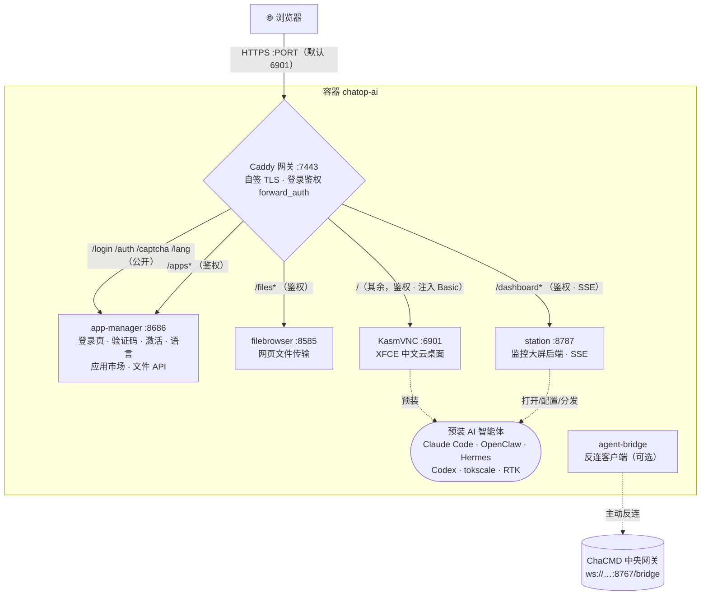

# chatop-ai · 察元AI工舱

> 🌐 **语言 / Language**：简体中文 ｜ [English](./README.en.md) ｜ [日本語](./README.ja.md) ｜ [Deutsch](./README.de.md) ｜ [Русский](./README.ru.md) ｜ [Italiano](./README.it.md)

**开箱即用的浏览器云桌面 —— 一台随开随用、内置 AI 智能体的远程工作站。**
基于 KasmVNC 定制：打开浏览器登录，即得一个中文 Linux 桌面，预装 Claude Code、OpenClaw、Hermes 等 AI 智能体、可视化配置器、应用市场、文件传输和工位监控大屏，全部收敛到**单一 HTTPS 端口**、由**统一登录闸门**把守。

> 定位：一名「数字员工」的工作站（**执行侧**）。可独立使用，也可作为 **ChaCMD 指挥系统** 的被编排节点（见文末「作为 ChaCMD 执行侧」）。

---

## 目录

- [核心特性](#核心特性)
- [架构总览](#架构总览)
- [部署方式](#部署方式)
  - [方式一 · 一键安装器（终端用户）](#方式一一键安装器终端用户推荐)
  - [方式二 · 源码构建（开发/自建）](#方式二源码构建开发自建)
  - [方式三 · 多工舱（一机多用户）](#方式三多工舱一机多用户)
  - [已发布镜像](#已发布镜像)
- [配置项（环境变量）](#配置项环境变量)
- [数据与持久化](#数据与持久化)
- [序列号激活闸门（可选）](#序列号激活闸门可选)
- [作为 ChaCMD 执行侧](#作为-chacmd-指挥系统的执行侧)
- [许可证](#许可证)

---

## 核心特性

### 🖥️ 浏览器云桌面
- 基于 **KasmVNC**（`kasmweb/core-ubuntu-jammy`）的 XFCE 桌面，纯网页访问，无需装客户端。
- **全中文环境**：`zh_CN.UTF-8` locale + Noto CJK / 文泉驿字体 + 中文语言包，开箱即中文。
- 内置 **Google Chrome**（容器内自动带 `--no-sandbox`，作为各类 Web 智能体的载体）。

### 🔒 单端口 · 统一登录闸门
- 对外只暴露**一个 HTTPS 端口**（默认 `6901`），容器内由 **Caddy** 网关反代 KasmVNC、文件浏览器、应用管理器、监控大屏。
- **自定义品牌登录页**：账号 + 密码 + **图形验证码**（无状态签名 Cookie，不占服务端存储）。
- 登录后签发 Cookie，网关对**所有**子服务统一 `forward_auth` 鉴权；桌面的 Basic 凭据由网关注入，浏览器**永不弹**原生认证框。

### 🤖 预装 AI 智能体（桌面双击即用）
镜像默认预装并生成桌面图标，双击「未配置先弹配置、已配置直接跑」：

| 智能体 | 说明 |
|---|---|
| **Claude Code** | Anthropic 官方编码 CLI |
| **Codex** | OpenAI Codex CLI |
| **OpenClaw** | 多通道 AI 网关（配套可视化配置器，见下） |
| **Hermes Agent** | 常驻智能体运行时（`PREINSTALL_HEAVY=1` 默认预装） |
| **tokscale** | Token 用量监控 TUI |
| **RTK** | 省 Token 工具 |
| **OpenHuman** | 人机协作桌面型智能体（默认不预装，走应用市场按需装） |

### 🧩 OpenClaw 可视化配置器
- tkinter 向导式 GUI（`openclaw-tool/`），**JSON Schema 驱动**递归渲染，中英双语标签。
- 覆盖模型（主/备/视觉）、多通道（Telegram/Discord 等）Token 与策略、会话作用域等全量配置，保存即可重启网关生效。
- 构建期烤入 openclaw 目录**快照**（≥20 通道），GUI 启动只读快照、绝不在启动路径调 CLI（避免每次 8~12s 卡顿）。

### 🏪 应用市场（125+ 应用，国内优化）
- `app-manager` 提供图形化应用市场，一键装/卸/启动，实时进度日志。
- **125 个应用**：AI CLI、AI IDE/插件、运行时、办公、即时通讯、媒体，以及 90+ 个 PRoot 打包的 GUI 应用（免 root 装进用户目录）。
- **国内化**：npm/pip/GitHub/GHCR 全部走国内镜像（`mirrors.conf`）；应用按地区（`cn`/`intl`）自动选源，跟随界面语言。

### 📊 工位监控大屏
- `station`（FastAPI，端口 `8787`）+ `dashboard-web`（React + Vite）实时大屏，随桌面自启。
- 展示：智能体墙（状态/CPU/内存/会话）、任务列表（**SSE 实时**）、任务下发、容器资源与各服务健康。
- 支持从大屏直接**打开 / 配置 / 分发**智能体。

### 📂 文件传输 · 剪贴板管控
- 内置 **filebrowser**（网关 Cookie 把关），网页上传/下载；上传/下载可分别开关，单文件上限可配。
- 剪贴板**双向独立**开关：容器→本地、本地→容器可各自允许/禁止。

### 🌐 多语言（5 语言）
- 简体中文 / English / 繁體中文 / 日本語 / 한국어。
- 登录页、鉴权、激活文案全量翻译；语言选择存 Cookie + 卷内文件，桌面 locale 跟随（切换后桌面需重启生效）。

---

## 架构总览

### 镜像分层（多阶段构建）
```
① web      : node:20-alpine  → 构建定制 noVNC 前端（novnc-src/）
② dashweb  : node:20-alpine  → 构建监控大屏前端（dashboard-web/）
③ runtime  : kasmweb/core-ubuntu-jammy:1.19.0
             + filebrowser + Caddy + Node22 + Python3.11 + Chrome + proot-apps
             + 预装智能体 → 迁 seed-home（运行时播种回用户卷）
             + app-manager / station / openclaw-tool / caddy 配置
```
> 重/联网层在前（缓存稳定、迭代不重下），快变 COPY 层在后；消费 `${VERSION}` 的 LABEL/ENV 放在最尾，避免改版本号触发全量重建。

### 运行时端口与网关
对外**只有一个端口**；容器内所有服务经 Caddy 收口、统一鉴权：



<details><summary>纯文本版（同一映射）</summary>

```
宿主 :PORT(默认6901)  ──►  容器内 Caddy :7443 (自签 TLS)
                              │  forward_auth 统一校验登录 Cookie
                              ├─ /login /auth /captcha /lang ─► app-manager :8686  (公开，登录闸门)
                              ├─ /apps*        ──(鉴权)──────► app-manager :8686  (应用市场/文件API)
                              ├─ /files*       ──(鉴权)──────► filebrowser :8585  (noauth，靠网关把关)
                              ├─ /dashboard*   ──(鉴权,SSE)──► station     :8787  (监控大屏)
                              └─ /（其余）      ──(鉴权)──────► KasmVNC    :6901  (桌面本体，注入 Basic)
```
</details>

| 容器内服务 | 端口 | 职责 |
|---|---|---|
| Caddy | 7443 | 唯一对外入口、TLS、登录鉴权、反代 |
| app-manager | 8686 | 登录页/验证码/激活/语言、应用市场、文件传输 API（Python 标准库 HTTP 服务） |
| filebrowser | 8585 | 网页文件管理（noauth，由网关 Cookie 把关） |
| station | 8787 | 工位监控大屏后端（FastAPI，含 SSE） |
| KasmVNC | 6901 | 云桌面本体（含 WebSocket） |

启动编排：容器入口 `chatop-lang-entrypoint`（先按用户选择的语言设好 locale）→ KasmVNC 启动链 → `custom_startup` 并发拉起 **播种用户目录 → filebrowser → Caddy → app-manager → station → 壁纸**。

---

## 部署方式

> 前提：目标机器装了 Docker。以下三种方式任选其一。

### 方式一·一键安装器（终端用户，推荐）

一条命令完成「检查/安装 Docker → 设账号密码 → 拉镜像 → 启动 → 打开浏览器」。

**Linux / macOS：**
```bash
curl -fsSL https://<你的域名>/install.sh | bash
```
**Windows（PowerShell）：**
```powershell
irm https://<你的域名>/install.ps1 | iex
```

- 过程中提示设置**登录用户名/密码**（密码留空自动生成），装完自动打开 `https://localhost:6901`（自签证书，浏览器点「继续」即可）。
- **国内拉取慢**改用阿里云 ACR 镜像：
  ```bash
  CHATOP_IMAGE=crpi-4i9j7th8clu2wz0j.cn-beijing.personal.cr.aliyuncs.com/cmdbird/chatop:latest \
    curl -fsSL https://<你的域名>/install.sh | bash
  ```
- **非交互**（自动化）：预设 `CHATOP_USER` / `CHATOP_PASSWORD` / `CHATOP_PORT` / `CHATOP_IMAGE` 环境变量即可。
- 无 Docker 时：Linux 用 `get.docker.com` 自动装；macOS 走 Homebrew；Windows 走 winget/choco 装 Docker Desktop，失败则打开下载页引导，装好重跑续装。

安装器在 `~/.chatop`（Windows `%USERPROFILE%\.chatop`）生成 `.env` + `docker-compose.yml`。日常停/起：
```bash
cd ~/.chatop && docker compose down      # 停（保留数据卷）
cd ~/.chatop && docker compose up -d      # 起
cd ~/.chatop && docker compose pull && docker compose up -d   # 更新到最新镜像
```

安装器脚本见 [`install/`](./install/)。

### 方式二·源码构建（开发/自建）

从源码构建并起容器（单一 Dockerfile，同机分层缓存，迭代不重下）：
```bash
cp .env.example .env      # 按需改端口/密码
./build-and-run.sh        # 版本号自增 → 构建 → 起容器（容器名固定 chatop-ai）
```
访问 `https://localhost:${PORT:-6901}`。

- 走构建代理下载：`./build-and-run.sh http://127.0.0.1:7890`
- 可选构建开关（`docker compose build --build-arg ...`）：
  - `PREINSTALL_HEAVY=1`（默认）预装 Hermes；`PREINSTALL_OPENHUMAN=1` 追加烤入 OpenHuman（约 +1.3GB）。
  - `CHATOP_LICENSE_HMAC_KEY=<64位hex>` 开启序列号激活闸门（见下）。
  - `WITH_CHAYUAN_DESKTOP=1` 且 `vendor/` 有 `.deb` 时烤入察元桌面客户端（Lite）。

### 方式三·多工舱（一机多用户）

在**同一台宿主**部署任意多个互相隔离的工舱：各自独立登录名/密码/数据目录/容器，**端口自动避让**。
```bash
cd workbay
./new-workbay.sh                       # 交互输入用户名+密码，自动分配空闲端口并起容器
WB_USER=alice WB_PW='强密码' ./new-workbay.sh   # 非交互
./reset-workbay.sh alice               # 改某工舱账号/密码（端口不变）
```
- 端口从 `6901` 起自动跳过已占用端口；每个工舱数据在 `workbays/<user>/home`（绑定挂载，删容器不丢数据）。
- 密码含 `$`、空格、引号等特殊字符**逐字节安全**（写 `.env` 时 `$`→`$$`，读回不 `source`）。
- 详见 [`workbay/README.md`](./workbay/README.md)。

### 已发布镜像

镜像统一 `latest` tag（发新版覆盖同 tag，用户始终拉最新）：

| Registry | 地址 |
|---|---|
| Docker Hub（默认） | `cmdbird/chatop:latest` |
| 阿里云 ACR（国内加速） | `crpi-4i9j7th8clu2wz0j.cn-beijing.personal.cr.aliyuncs.com/cmdbird/chatop:latest` |

---

## 配置项（环境变量）

在 `.env`（或安装器生成的 `.env`）中设置：

| 变量 | 默认 | 说明 |
|---|---|---|
| `PORT` | `6901` | 对外唯一 HTTPS 端口 |
| `PASSWORD` | — **（必填）** | 登录密码 |
| `LOGIN_USER` | `admin` | 网页登录用户名（容器内 OS 用户恒为 `admin`） |
| `FILES_UPLOAD` | `1` | 允许网页上传（`0` 关闭） |
| `FILES_DOWNLOAD` | `1` | 允许网页下载（`0` 关闭） |
| `FILES_DIR` | `~/Desktop` | 上传目标 / 下载来源目录 |
| `CLIPBOARD_OUT` | `1` | 容器内复制→本地可粘贴 |
| `CLIPBOARD_IN` | `1` | 本地复制→容器内可粘贴 |
| `CHATOP_LICENSE_HMAC_KEY` | 空 | 激活密钥（64 位 hex）；空=闸门关闭。**构建期**注入烤进镜像，或运行时覆盖 |
| `CHATOP_MACHINE_ID` | 空 | 固定本机指纹（可选）；默认指纹派生自数据卷，删卷会变 |

> 内部服务端口（`APPS_PORT=8686` / `FB_PORT=8585` / `STATION_PORT=8787`）一般无需改，均只在容器内环回、由 Caddy 收口。

---

## 数据与持久化

- 用户数据卷挂到容器内 `/home/admin`（compose 卷 `chatop-home`，或多工舱模式下 `workbays/<user>/home`）。
- 卷内 `~/.local/share/chatop/` 存：机器指纹（`node-id`）、激活记录（`activation.json`）、语言选择（`lang`）。
- `docker compose down` 保留卷；`down -v` **删卷**会丢数据、指纹变化、需重新激活。

---

## 序列号激活闸门（可选）

官方镜像可内置**纯离线**序列号激活（`app-manager/chatop_license/`，HMAC-SHA256 校验，不联网）：

- **开启**：构建时注入 `CHATOP_LICENSE_HMAC_KEY`（与签发后台同一把密钥），登录页出现序列号输入；不注入则闸门关闭，行为回退到「用户名+密码+验证码」。
- **绑定机器**：激活记录签名含机器指纹，防跨机拷贝、防篡改到期日、防时钟回拨续命。
- **软放行**：15 分钟内连错 3 次，本次降级为纯密码登录（签发 24h 宽限 Cookie），但**不落盘激活记录**——下次登录仍需序列号，避免试错「蒙混激活」。
- **注意**：纯离线验证意味着镜像内含对称密钥。镜像若推公开 registry，密钥即公开——这是**业务闸门**，非数学防伪。

---

## 作为 ChaCMD 指挥系统的执行侧

本镜像 = 一名数字员工的工作站（**执行侧**）。中央编排/调度由 **ChaCMD 指挥系统**（`/work/chayuan-desktop`）承担。

容器内 [`agent-bridge/`](./agent-bridge/) 是**反连客户端**：主动拨出到 ChaCMD 网关（`ws://<chacmd-host>:8767/bridge`），按**昵称**（逻辑标识，非 IP）+ 所属**部门**注册并心跳（NAT/隔离友好，中央不主动连容器）。调度器、CI 门禁、评审、晨审队列等中央机制部署在 DMZ 隔离区。

> `agent-bridge` 为面向 ChaCMD 生态的预留常驻组件；两个项目的端到端联调见 `/work/chayuan-desktop/chacmd/README.md`。

---

## 许可证

本项目以 **GPL-2.0** 发布，全文见 [`LICENSE`](./LICENSE)。

之所以开源，是因为云桌面底座 **KasmVNC 采用 GPL-2.0**，我们随镜像再分发它。源码公开、不限并发、不锁品牌——你可以自由修改、再分发，并从源码自行构建镜像。

官方镜像内置的序列号激活（`app-manager/chatop_license/`，纯离线 HMAC 校验）买到的是**开箱即跑的官方构建、持续更新与商业支持**，不是「解锁功能」；依据 GPL-2.0 第 6 条，本项目不对你行使许可证权利施加任何进一步限制。

边界提示：
- `novnc-src/` 是 vendored 的 [@kasmtech/noVNC](https://github.com/kasmtech/noVNC)，适用 **MPL-2.0**（及 BSD / OFL / CC BY-SA），保留其自身 [`novnc-src/LICENSE.txt`](./novnc-src/LICENSE.txt)。
- **分发镜像即分发 KasmVNC**：GPL-2.0 第 3 条要求随附对应源码，或提供一份至少三年有效的书面源码获取要约。
- 官方镜像预装 **Google Chrome、Claude Code 等专有软件**，各自受上游条款约束，不在本项目 GPL-2.0 覆盖范围内；公开再分发前请自行确认其条款。

完整第三方组件与许可说明见 [`THIRD-PARTY-NOTICES.md`](./THIRD-PARTY-NOTICES.md)，设计文档见 [`docs/`](./docs/)。
