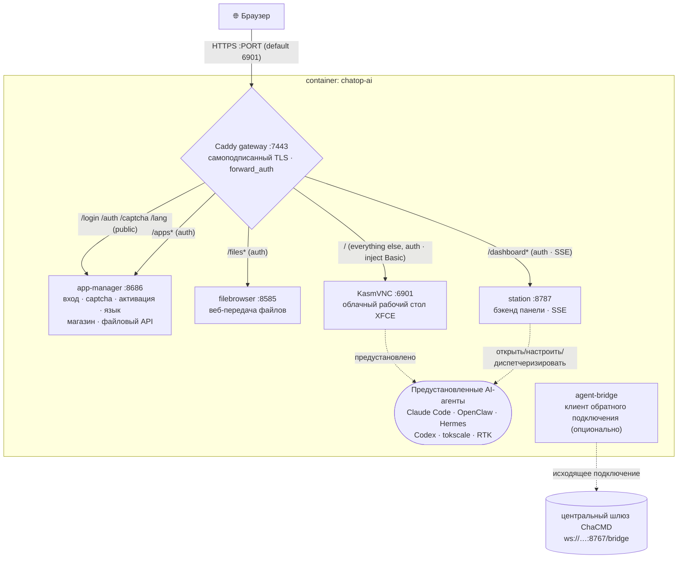

# chatop-ai · 察元AI工舱

> 🌐 **语言 / Language**: [简体中文](./README.md) ｜ [English](./README.en.md) ｜ [日本語](./README.ja.md) ｜ [Deutsch](./README.de.md) ｜ Русский ｜ [Italiano](./README.it.md)

**Готовый к работе облачный рабочий стол в браузере — мгновенная удалённая рабочая станция со встроенными AI-агентами.**
Кастомный облачный рабочий стол на базе KasmVNC: откройте браузер, войдите в систему и получите китайско-английский Linux-рабочий стол с предустановленными AI-агентами (Claude Code, OpenClaw, Hermes …), визуальным конфигуратором, магазином приложений, передачей файлов и панелью мониторинга рабочей станции — всё это проходит через **единственный HTTPS-порт** и защищено **единым шлюзом входа**.

> Позиционирование: рабочая станция одного «цифрового сотрудника» (**сторона исполнения**). Пригодна как самостоятельное решение или как оркестрируемый узел **командной системы ChaCMD** (см. [В роли узла-исполнителя ChaCMD](#as-a-chacmd-execution-node)).

---

## Содержание

- [Ключевые возможности](#key-features)
- [Архитектура](#architecture)
- [Развёртывание](#deployment)
  - [Вариант 1 · Установщик в один клик (конечные пользователи)](#option-1--one-click-installer-end-users-recommended)
  - [Вариант 2 · Сборка из исходников (разработка / self-host)](#option-2--build-from-source-dev--self-host)
  - [Вариант 3 · Мульти-воркбей (много пользователей, один хост)](#option-3--multi-workbay-many-users-one-host)
  - [Опубликованные образы](#published-images)
- [Конфигурация (переменные окружения)](#configuration-environment-variables)
- [Данные и постоянное хранение](#data--persistence)
- [Активация по серийному номеру (опционально)](#serial-number-activation-gate-optional)
- [В роли узла-исполнителя ChaCMD](#as-a-chacmd-execution-node)
- [Лицензия](#license)

---

## Ключевые возможности

### 🖥️ Облачный рабочий стол в браузере
- Рабочий стол **XFCE** поверх **KasmVNC** (`kasmweb/core-ubuntu-jammy`), доступ исключительно через браузер — не нужно устанавливать клиент.
- **Полностью китайская среда**: локаль `zh_CN.UTF-8` + шрифты Noto CJK / WenQuanYi + китайские языковые пакеты, китайский язык прямо «из коробки».
- Встроенный **Google Chrome** (внутри контейнера автоматически с `--no-sandbox`) как носитель для веб-агентов.

### 🔒 Единственный порт · единый шлюз входа
- Наружу открыт ровно **один HTTPS-порт** (по умолчанию `6901`); внутри контейнера **Caddy** обратным проксированием обслуживает KasmVNC, файловый браузер, менеджер приложений и панель мониторинга.
- **Кастомная брендированная страница входа**: имя пользователя + пароль + **графическая CAPTCHA** (безсостоянийная подписанная cookie, без хранения на сервере).
- После входа шлюз выдаёт cookie и единообразно применяет `forward_auth` ко **всем** дочерним сервисам; учётные данные Basic-авторизации рабочего стола внедряются шлюзом, поэтому нативный запрос авторизации браузера **никогда не появляется**.

### 🤖 Предустановленные AI-агенты (запуск двойным кликом)
Образ предустанавливает их и создаёт значки на рабочем столе — двойной клик запускает по принципу «сначала настроить, если не настроено, иначе сразу выполнить»:

| Агент | Примечания |
|---|---|
| **Claude Code** | Официальный CLI для программирования от Anthropic |
| **Codex** | CLI OpenAI Codex |
| **OpenClaw** | Многоканальный AI-шлюз (с визуальным конфигуратором, см. ниже) |
| **Hermes Agent** | Резидентная среда выполнения агента (предустановлена по умолчанию через `PREINSTALL_HEAVY=1`) |
| **tokscale** | TUI для мониторинга расхода токенов |
| **RTK** | Утилита для экономии токенов |
| **OpenHuman** | Настольный агент с участием человека в цикле (по умолчанию не предустановлен; устанавливается по требованию из магазина) |

### 🧩 Визуальный конфигуратор OpenClaw
- Мастер на tkinter (`openclaw-tool/`), **рекурсивная отрисовка на основе JSON-Schema**, с двуязычными (кит./англ.) подписями.
- Охватывает модели (основная / резервная / визуальная), токены и политики множества каналов (Telegram / Discord …), область сессии и многое другое — сохраните и перезапустите шлюз для применения.
- **Снимок** каталога openclaw (≥20 каналов) запекается на этапе сборки; GUI читает только снимок и никогда не вызывает CLI на пути запуска (что позволяет избежать задержки 8–12 с на каждый вызов).

### 🏪 Магазин приложений (125+ приложений, оптимизирован для Китая)
- `app-manager` предоставляет графический магазин: установка / удаление / запуск в один клик с журналом прогресса в реальном времени.
- **125 приложений**: AI CLI, AI IDE/расширения, среды выполнения, офис, мессенджеры, медиа, а также 90+ GUI-приложений, упакованных через PRoot (устанавливаются в домашний каталог пользователя, без root).
- **Оптимизация для Китая**: npm / pip / GitHub / GHCR — все маршрутизируются через внутренние зеркала (`mirrors.conf`); приложения автоматически выбирают источник `cn`/`intl` в соответствии с языком интерфейса.

### 📊 Панель мониторинга рабочей станции
- `station` (FastAPI, порт `8787`) + `dashboard-web` (React + Vite): живая панель, автоматически запускающаяся вместе с рабочим столом.
- Показывает стену агентов (статус / CPU / память / сессии), список задач (**в реальном времени через SSE**), диспетчеризацию задач, а также ресурсы контейнера и состояние каждого сервиса.
- Открывайте / настраивайте / диспетчеризируйте агентов прямо из панели.

### 📂 Передача файлов · управление буфером обмена
- Встроенный **filebrowser** (защищён cookie шлюза) для веб-загрузки/скачивания; загрузка и скачивание переключаются независимо, лимит размера на файл настраивается.
- **Двунаправленные, независимые** переключатели буфера обмена: контейнер→хост и хост→контейнер можно разрешать/запрещать по отдельности.

### 🌐 Мультиязычность (5 языков)
- Упрощённый китайский / английский / традиционный китайский / японский / корейский.
- Тексты входа, авторизации и активации полностью переведены; выбор языка хранится в cookie + файле тома, а локаль рабочего стола следует за ним (перезапустите рабочий стол для применения изменения).

---

## Архитектура

### Слои образа (многоэтапная сборка)
```
① web      : node:20-alpine  → builds the custom noVNC frontend (novnc-src/)
② dashweb  : node:20-alpine  → builds the dashboard frontend (dashboard-web/)
③ runtime  : kasmweb/core-ubuntu-jammy:1.19.0
             + filebrowser + Caddy + Node22 + Python3.11 + Chrome + proot-apps
             + preinstalled agents → moved to seed-home (seeded back to the user volume at runtime)
             + app-manager / station / openclaw-tool / caddy config
```
> Тяжёлые/сетевые слои идут первыми (стабильный кэш, без повторных загрузок между итерациями); быстро меняющиеся COPY-слои — последними; потребляющий `${VERSION}` LABEL/ENV размещён в самом конце, чтобы избежать полной пересборки при смене версии.

### Порты времени выполнения и шлюз
Существует **только один внешний порт**; каждый сервис внутри контейнера проходит через Caddy с единой авторизацией:



| Сервис в контейнере | Порт | Ответственность |
|---|---|---|
| Caddy | 7443 | Единственная внешняя точка входа: TLS, авторизация входа, обратный прокси |
| app-manager | 8686 | Страница входа/CAPTCHA/активация/язык, магазин, API передачи файлов (HTTP-сервер на стандартной библиотеке Python) |
| filebrowser | 8585 | Веб-управление файлами (noauth, защищено cookie шлюза) |
| station | 8787 | Бэкенд панели мониторинга рабочей станции (FastAPI, вкл. SSE) |
| KasmVNC | 6901 | Собственно облачный рабочий стол (вкл. WebSocket) |

Оркестрация запуска: точка входа контейнера `chatop-lang-entrypoint` (сначала устанавливает локаль в выбранный пользователем язык) → цепочка запуска KasmVNC → `custom_startup` параллельно запускает **инициализацию домашнего каталога → filebrowser → Caddy → app-manager → station → обои**.

---

## Развёртывание

> Предварительное условие: на целевой машине установлен Docker. Выберите один из трёх вариантов ниже.

### Вариант 1 · Установщик в один клик (конечные пользователи, рекомендуется)

Одна команда выполняет «проверить/установить Docker → задать аккаунт и пароль → скачать образ → запустить → открыть браузер».

**Linux / macOS:**
```bash
curl -fsSL https://<your-domain>/install.sh | bash
```
**Windows (PowerShell):**
```powershell
irm https://<your-domain>/install.ps1 | iex
```

- Вам будет предложено ввести **имя пользователя/пароль для входа** (оставьте пароль пустым для автогенерации); по завершении откроется `https://localhost:6901` (самоподписанный сертификат — нажмите «продолжить» в браузере).
- **Медленная загрузка в Китае?** Используйте образ Aliyun ACR:
  ```bash
  CHATOP_IMAGE=crpi-4i9j7th8clu2wz0j.cn-beijing.personal.cr.aliyuncs.com/cmdbird/chatop:latest \
    curl -fsSL https://<your-domain>/install.sh | bash
  ```
- **Неинтерактивно** (автоматизация): предварительно задайте `CHATOP_USER` / `CHATOP_PASSWORD` / `CHATOP_PORT` / `CHATOP_IMAGE`.
- Docker отсутствует: Linux устанавливает через `get.docker.com`; macOS через Homebrew; Windows через winget/choco (Docker Desktop), иначе открывается страница загрузки и работа продолжается при повторном запуске.

Установщик записывает `.env` + `docker-compose.yml` в каталог `~/.chatop` (на Windows `%USERPROFILE%\.chatop`). Повседневная остановка/запуск:
```bash
cd ~/.chatop && docker compose down      # stop (keeps the data volume)
cd ~/.chatop && docker compose up -d      # start
cd ~/.chatop && docker compose pull && docker compose up -d   # update to the latest image
```

Скрипты установщика: [`install/`](./install/).

### Вариант 2 · Сборка из исходников (разработка / self-host)

Соберите из исходников и запустите контейнер (единый Dockerfile, кэш слоёв на том же хосте, без повторных загрузок между итерациями):
```bash
cp .env.example .env      # adjust port / password
./build-and-run.sh        # auto-bumps the version → builds → starts (container name is fixed: chatop-ai)
```
Откройте `https://localhost:${PORT:-6901}`.

- Загрузка через прокси сборки: `./build-and-run.sh http://127.0.0.1:7890`
- Опциональные аргументы сборки (`docker compose build --build-arg ...`):
  - `PREINSTALL_HEAVY=1` (по умолчанию) предустанавливает Hermes; `PREINSTALL_OPENHUMAN=1` дополнительно запекает OpenHuman (~+1.3 ГБ).
  - `CHATOP_LICENSE_HMAC_KEY=<64-hex>` включает активацию по серийному номеру (см. ниже).
  - `WITH_CHAYUAN_DESKTOP=1` запекает настольный клиент Chayuan (Lite), когда `.deb` присутствует в каталоге `vendor/`.

### Вариант 3 · Мульти-воркбей (много пользователей, один хост)

Разверните любое количество взаимоизолированных воркбеев на **одном хосте**: у каждого свой логин/пароль/каталог данных/контейнер, с **автоматическим избеганием конфликта портов**.
```bash
cd workbay
./new-workbay.sh                       # prompts for username+password, auto-picks a free port, starts
WB_USER=alice WB_PW='strong-pass' ./new-workbay.sh   # non-interactive
./reset-workbay.sh alice               # change a workbay's account/password (port unchanged)
```
- Порты начинаются с `6901` и пропускают всё, что уже занято; данные каждого воркбея располагаются в `workbays/<user>/home` (bind-монтирование; удаление контейнера сохраняет данные).
- Пароли с `$`, пробелами, кавычками и т. п. **безопасны побайтово** (`$`→`$$` при записи в `.env`; никогда не выполняется `source` при обратном чтении).
- Подробности: [`workbay/README.md`](./workbay/README.md).

### Опубликованные образы

Образы используют общий тег `latest` (новый релиз перезаписывает тот же тег, поэтому пользователи всегда получают самую свежую версию):

| Реестр | Адрес |
|---|---|
| Docker Hub (по умолчанию) | `cmdbird/chatop:latest` |
| Aliyun ACR (ускорение для Китая) | `crpi-4i9j7th8clu2wz0j.cn-beijing.personal.cr.aliyuncs.com/cmdbird/chatop:latest` |

---

## Конфигурация (переменные окружения)

Задайте их в `.env` (или в сгенерированном установщиком `.env`):

| Переменная | По умолчанию | Описание |
|---|---|---|
| `PORT` | `6901` | Единственный внешний HTTPS-порт |
| `PASSWORD` | — **(обязательно)** | Пароль для входа |
| `LOGIN_USER` | `admin` | Имя пользователя для веб-входа (пользователь ОС внутри контейнера всегда `admin`) |
| `FILES_UPLOAD` | `1` | Разрешить веб-загрузку (`0` отключает) |
| `FILES_DOWNLOAD` | `1` | Разрешить веб-скачивание (`0` отключает) |
| `FILES_DIR` | `~/Desktop` | Целевой каталог загрузки / исходный каталог скачивания |
| `CLIPBOARD_OUT` | `1` | Копирование внутри контейнера → вставка на хосте |
| `CLIPBOARD_IN` | `1` | Копирование на хосте → вставка внутри контейнера |
| `CHATOP_LICENSE_HMAC_KEY` | пусто | Ключ активации (64-hex); пусто = активация выключена. Запекается на **этапе сборки** или переопределяется во время выполнения |
| `CHATOP_MACHINE_ID` | пусто | Фиксированный отпечаток машины (опционально); отпечаток по умолчанию вычисляется из тома данных и меняется при удалении тома |

> Внутренние порты сервисов (`APPS_PORT=8686` / `FB_PORT=8585` / `STATION_PORT=8787`) обычно не требуют изменений — внутри контейнера они доступны только по loopback и проходят через Caddy.

---

## Данные и постоянное хранение

- Том пользовательских данных монтируется в `/home/admin` внутри контейнера (том compose `chatop-home` или `workbays/<user>/home` в режиме мульти-воркбея).
- Внутри тома `~/.local/share/chatop/` содержит: отпечаток машины (`node-id`), запись активации (`activation.json`) и выбор языка (`lang`).
- `docker compose down` сохраняет том; `down -v` **удаляет том** — вы теряете данные, отпечаток меняется, и требуется повторная активация.

---

## Активация по серийному номеру (опционально)

Официальный образ может встраивать **полностью офлайн** активацию по серийному номеру (`app-manager/chatop_license/`, HMAC-SHA256, без сети):

- **Включение**: внедрите `CHATOP_LICENSE_HMAC_KEY` на этапе сборки (тот же ключ, что и у бэкенда выдачи); после этого страница входа показывает поле ввода серийного номера. Без него активация выключена, и поведение возвращается к «имя пользователя + пароль + CAPTCHA».
- **Привязка к машине**: подпись записи активации включает отпечаток машины — что предотвращает копирование на другую машину, подделку срока действия и продление откатом часов.
- **Мягкий пропуск**: после 3 неверных попыток в течение 15 минут эта сессия деградирует до входа только по паролю (выдаётся льготная cookie на 24 ч), но запись активации **не сохраняется** — следующий вход всё равно требует серийного номера, что предотвращает «блеф» ради активации.
- **Примечание**: полностью офлайн-проверка означает, что образ содержит симметричный ключ. Если образ отправлен в публичный реестр, ключ становится публичным — это **бизнес-барьер**, а не криптографическая защита от пиратства.

---

## В роли узла-исполнителя ChaCMD

Этот образ = рабочая станция одного цифрового сотрудника (**сторона исполнения**). Центральная оркестрация/планирование обеспечивается **командной системой ChaCMD** (`/work/chayuan-desktop`).

Внутри контейнера [`agent-bridge/`](./agent-bridge/) — это **клиент обратного подключения**: он инициирует исходящее соединение со шлюзом ChaCMD (`ws://<chacmd-host>:8767/bridge`) и регистрируется по **никнейму** (логическая идентичность, а не IP) + **отделу**, затем отправляет heartbeat (дружественно к NAT/изоляции — центр никогда не подключается внутрь контейнера). Механизмы планировщика, CI-барьера, ревью и утренней очереди располагаются в изолированной зоне DMZ.

> `agent-bridge` — зарезервированный резидентный компонент экосистемы ChaCMD; полную сквозную интеграцию обоих проектов см. в `/work/chayuan-desktop/chacmd/README.md`.

---

## Лицензия

Выпущено под **GPL-2.0**; полный текст в [`LICENSE`](./LICENSE).

Открытый исходный код обусловлен тем, что базовый облачный рабочий стол **KasmVNC распространяется под GPL-2.0**, и мы поставляем его вместе с образом. Исходники открыты, параллелизм не ограничен, бренд разблокирован — вы можете изменять, распространять и собирать образ из исходников самостоятельно.

Встроенная в официальный образ активация по серийному номеру (`app-manager/chatop_license/`, полностью офлайн HMAC) даёт вам **готовую к запуску официальную сборку, непрерывные обновления и коммерческую поддержку** — а не «разблокировку функций». Согласно GPL-2.0 §6, этот проект не налагает никаких дополнительных ограничений на осуществление вами лицензионных прав.

Границы, о которых стоит знать:
- `novnc-src/` — это встроенная копия [@kasmtech/noVNC](https://github.com/kasmtech/noVNC) под **MPL-2.0** (а также BSD / OFL / CC BY-SA), сохраняющая собственный [`novnc-src/LICENSE.txt`](./novnc-src/LICENSE.txt).
- **Распространение образа = распространение KasmVNC**: GPL-2.0 §3 требует прилагать соответствующие исходники или письменное предложение, действительное не менее трёх лет.
- Официальный образ предустанавливает **Google Chrome, Claude Code и другое проприетарное ПО**, каждое из которых регулируется собственными условиями вышестоящего поставщика, вне рамок GPL-2.0 этого проекта; проверьте их условия перед публичным распространением.

Полный перечень сторонних компонентов и лицензионные примечания: [`THIRD-PARTY-NOTICES.md`](./THIRD-PARTY-NOTICES.md); проектные документы в [`docs/`](./docs/).
